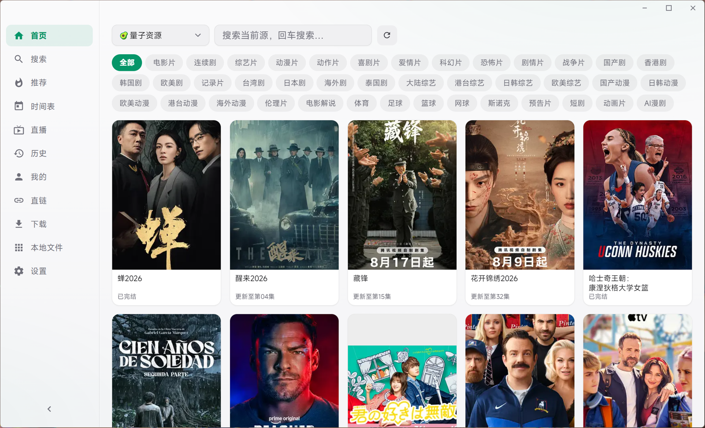
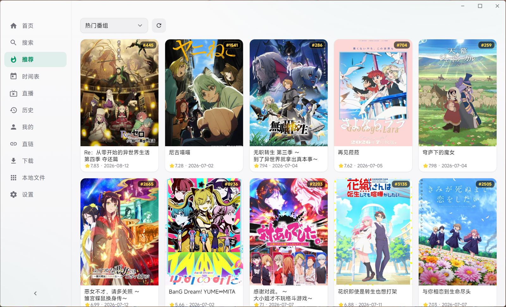
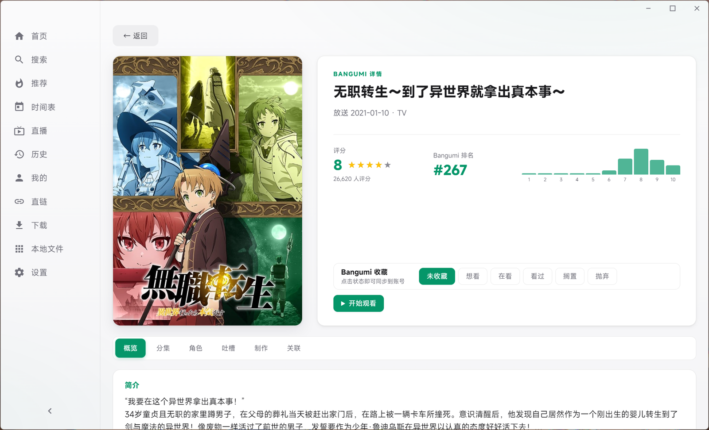
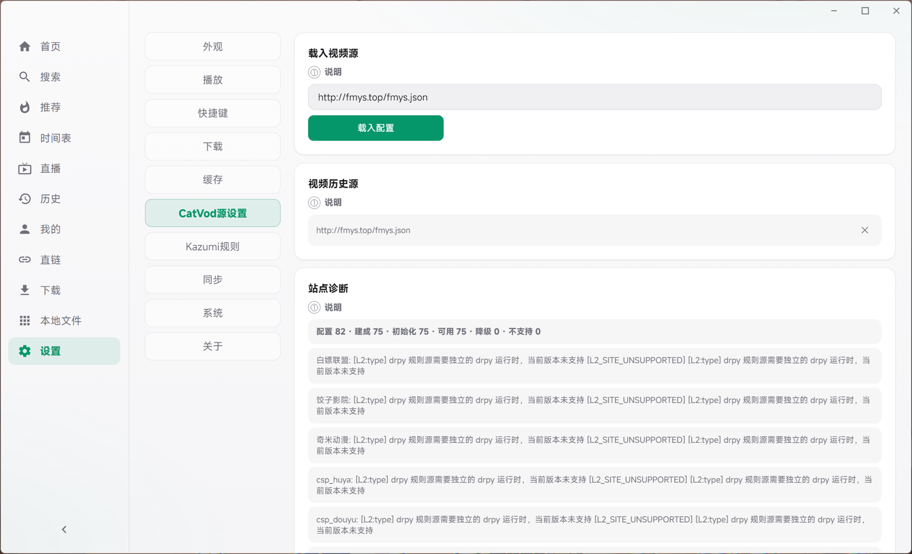
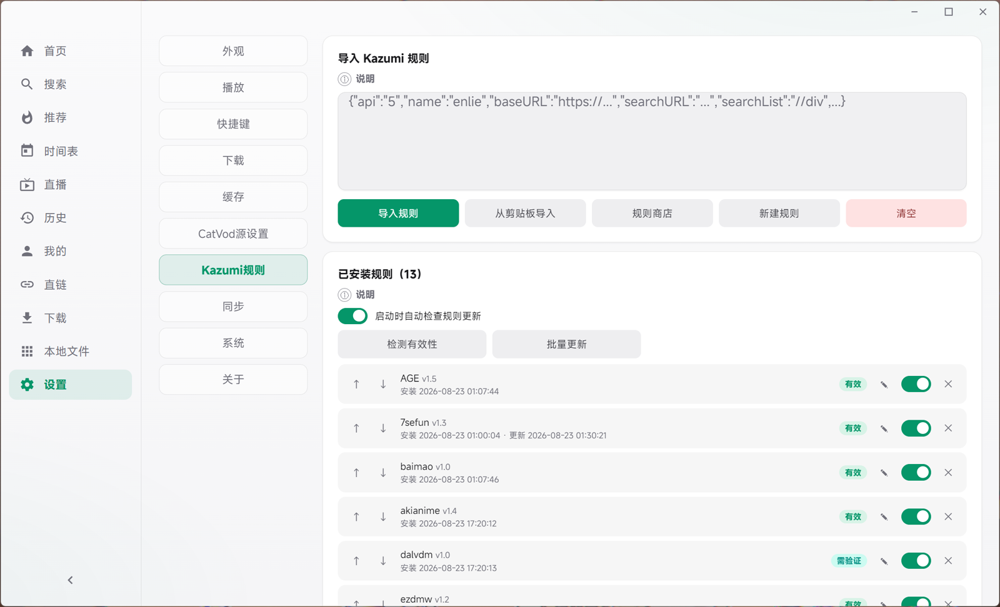
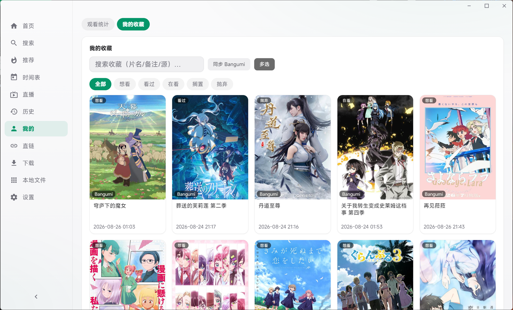

<div align="center">


# YuKi

**聚合 · 本地优先的影视探索桌面**

[](https://github.com/Arimayuki03/YuKi/actions/workflows/ci.yml)
[](https://github.com/Arimayuki03/YuKi/actions/workflows/release.yml)
[](https://github.com/Arimayuki03/YuKi/releases)
[](LICENSE)
[](https://github.com/Arimayuki03/YuKi/releases)
[](https://www.electronjs.org/)
[](https://www.python.org/)
[](https://github.com/Arimayuki03/YuKi/stargazers)

</div>

---

YuKi 是一个面向桌面的影视聚合应用：使用 **Electron** 作为界面与系统宿主，使用独立 **FastAPI/Python** 进程运行 **CatVod** 与 **Kazumi** 两套内容引擎，并通过 **mpv**、**aria2c** 和 **ffmpeg** 完成播放与下载。坚持 **本地优先、无追踪**——不上传任何个人数据。

> 当前版本 `v0.2.5` · 主要开发与验证平台为 Windows。内部包名、数据目录与 IPC 前缀仍为 `yuki`，仅显示名为 YuKi。

## ✨ 功能特性

- **双内容引擎**：CatVod 配置源（Python / JavaScript / CMS 爬虫）、聚合搜索、详情与播放链路完整；Kazumi 规则导入、商店、编辑、测试、搜索、剧集解析与真实视频流提取已接入。
- **mpv 播放体验**：自动连播、续播、Anime4K 实时超分（三档位，支持快捷键循环切换）、截图；mpv 右键菜单已中文化。指定本机任意 mpv 构建即享受与内置完全一致的全功能体验；也可指定 VLC / PotPlayer 等外部播放器接管播放——起播与整季连播可用（播放列表照常加载），但超分、快捷键、截图与进度回传等 mpv 专属能力不可用。
- **原生播放列表与边下边播**：在线整季经本地按需解析代理交给 mpv 原生队列连播（直链零过期），同源同集下载自动去重；网盘类源（夸克等）自动回退逐集连播并禁用线路回退，防止触发网盘风控。
- **下载体系**：aria2c 直链下载、ffmpeg HLS 下载、下载记录与系统通知。
- **数据与同步**：收藏、历史、观看统计、Bangumi 账号同步（评分 / 收藏 / 观看进度自动上报）、WebDAV 备份、本地文件管理。
- **界面视觉系统**：按 [DESIGN.md](DESIGN.md) 契约构建（中性灰阶骨架 + 主题色点睛 + 动效令牌），背景图片支持拖动定位、缩放、透明度与模糊的自定义调整。

## 🖼 界面预览

| 首页 · CatVod 聚合源浏览 | 推荐 · Bangumi 热门番组 |
|:--:|:--:|
|  |  |
| **Bangumi 详情 · 评分与收藏同步** | **设置 · CatVod 源配置与站点诊断** |
|  |  |
| **设置 · Kazumi 规则管理** | **我的收藏 · 番剧列表与状态筛选** |
|  |  |

## 📥 安装

前往 [Releases](https://github.com/Arimayuki03/YuKi/releases/latest) 下载最新 Windows 安装包（`YuKi-Setup-x.y.z.exe`），双击安装即可。

- 系统要求：Windows 10 及以上（x64）。
- 应用内置自动更新（electron-updater），无需手动升级。
- macOS / Linux 打包（dmg / AppImage / deb）仍在验证中，暂未提供安装包。

> **杀软报毒说明**：打包钩子已剔除两类「系统自带冗余 DLL」误报源——Electron 自带的 `d3dcompiler_47.dll` 与 PyInstaller 后端捆绑的 UCRT（`ucrtbase.dll` + `api-ms-win-*` 转发器）；Win10+ 系统 System32 自带这些运行库，剔除不影响运行与渲染。若仍被误报，可在杀软中加白并向上游提交误报申诉。

## 🧭 初次使用

安装启动后，建议按顺序完成四步（详细说明见[使用指南](docs/GUIDE.md)）：

1. **添加影视源**：「设置 → CatVod 源设置」粘贴一个 TVBox 配置 URL 载入视频源；
2. **添加番剧规则**：「设置 → Kazumi 规则 → 规则商店」一键安装番剧源（内置 3 条默认规则开箱即用；无法访问 GitHub 的网络环境，先在「设置 → 系统 → 网络」打开「规则仓库镜像」与「Bangumi 镜像」）；
3. **配置网盘账号**（可选）：看网盘类源（夸克 / UC 等）需先在「设置 → CatVod 源设置 → 网盘账号」配置 Cookie 或夸克扫码登录；
4. **选择播放器**（可选）：默认内置 mpv 全功能可用；也可在「设置 → 系统 → 组件状态」指定本机 mpv（体验一致）或 VLC / PotPlayer（外部模式，连播可用但无超分/快捷键/进度回传）。

之后在首页或搜索页选片播放即可。所有数据仅保存在本机，详见[隐私政策](#-隐私政策)。

## 🚀 快速开始（开发）

环境要求：Node.js 20+、Python 3.14，以及项目脚本管理的 mpv、aria2c、ffmpeg 等二进制资源（`npm install` 与构建脚本会自动下载并校验）。

```powershell
git clone https://github.com/Arimayuki03/YuKi.git
cd YuKi
npm install
npm start
```

常用命令：

| 命令 | 说明 |
|---|---|
| `npm start` | 启动开发实例 |
| `npm run test:all` | 完整回归（Python 测试 + JS 单测 + Lint） |
| `npm run build:win` | 构建 Windows 安装包 |
| `npm run lint` / `npm run lint:py` | ESLint / Ruff 检查 |

更完整的环境、架构与构建说明见 [开发状态](PROGRESS.md)、[架构说明](docs/ARCHITECTURE.md) 与 [文件结构](docs/FILE_STRUCTURE.md)。

## 🏗 技术架构

```
┌─────────────────────────────────────────────┐
│                Electron 主进程               │
│      窗口管理 · IPC · 下载 · mpv 宿主        │
└──────────────────┬──────────────────────────┘
                   │ HTTP (127.0.0.1, token 鉴权)
┌──────────────────▼──────────────────────────┐
│           Python 后端（FastAPI）             │
│   CatVod Spider 引擎 · Kazumi 规则引擎       │
│     聚合搜索 · 播放解析 · HLS 代理            │
└──────────────────┬──────────────────────────┘
                   │
      ┌────────────┼────────────┐
      ▼            ▼            ▼
   mpv 播放     aria2c 下载   ffmpeg HLS
```

- **进程模型**：Electron 主进程 + 渲染进程 + 独立 Python 后端进程，全部本地通信走 `127.0.0.1` 且带 token 鉴权。
- **安全边界**：本地服务具备浏览器防御（Origin/Host 校验）、SSRF 逐跳复检、Cookie 加密落盘（DPAPI/AES-GCM）等纵深防护，详见[系统架构](docs/ARCHITECTURE.md)。

## 📚 文档导航

先看 [文档索引](docs/README.md)，再按任务进入对应文档。

| 目的 | 文档 |
|---|---|
| 了解当前状态、边界和下一步 | [PROGRESS.md](PROGRESS.md) |
| 了解视觉系统契约（色彩/排版/动效令牌） | [DESIGN.md](DESIGN.md) |
| 了解项目文档层级和维护规则 | [docs/README.md](docs/README.md) |
| 了解进程、接口、数据流和安全边界 | [系统架构](docs/ARCHITECTURE.md) |
| 了解 Kazumi 当前实现与差距 | [Kazumi 规则引擎](docs/KAZUMI.md) |
| 查看最新运行异常与复测证据 | [运行时问题](docs/RUNTIME_ISSUES.md) |
| 查看自动化测试和用户实测清单 | [功能测试报告](docs/TEST_REPORT.md) |
| 查看历史批次和设计决策 | [历史开发记录](docs/DEVELOPMENT_HISTORY.md) |
| 参与贡献 / 行为准则 / 发布流程 | [CONTRIBUTING.md](CONTRIBUTING.md) · [CODE_OF_CONDUCT.md](CODE_OF_CONDUCT.md) |
| 查看版本变更记录 | [CHANGELOG.md](CHANGELOG.md) |
| 查看随安装包分发的第三方组件许可 | [第三方组件与许可声明](docs/THIRD_PARTY.md) |

### 执行计划

- [TVBox/FongMi 功能一致性任务书](docs/TVBOX_FONGMI_PARITY_TASKS.md) · 运行时隔离、播放收敛与发布验收（当前唯一执行入口）

## 🗺 路线图

- [x] CatVod / Kazumi 双引擎、聚合搜索与播放链路
- [x] mpv 播放 + Anime4K 超分 + 原生播放列表 + 边下边播
- [x] aria2c / ffmpeg 下载体系、Bangumi 同步、WebDAV 备份
- [x] TVBox 兼容性基础能力（全量回归与 FongMi 契约审计进行中）
- [ ] macOS / Linux 打包验证与安装后冷启动验收
- [ ] 弹幕（产品当前不启用弹幕界面与播放时弹幕加载；仓库保留的 DanDanPlay API / ASS 代码仅作兼容基础）
- [ ] 一起看（多人同屏共播）

## 🤝 参与贡献

欢迎提交 Issue 与 Pull Request！请先阅读 [CONTRIBUTING.md](CONTRIBUTING.md) 与 [行为准则](CODE_OF_CONDUCT.md)。开发与回归流程、发布流程见相应文档。

## 🛡 免责声明

> 请在使用前仔细阅读本节。继续使用 YuKi 即视为已理解并同意以下条款。

1. **内容来源**：YuKi 本身不提供、存储、托管或分发任何影视内容。所有可播放资源均来自用户自行添加的 CatVod / Kazumi 配置源（第三方网站、规则脚本）或本地文件。内容的可用性、准确性、合法性与版权归属均由源站方负责，与 YuKi 开发者无关。

2. **仅供学习与技术研究**：本项目为开源聚合播放器框架，用于研究 Electron + Python 双进程架构、爬虫规则解析与多媒体工具链整合。开发者未对任何源的版权合规性进行背书，不鼓励、不支持任何侵犯版权或违反当地法律法规的使用行为。

3. **用户责任**：用户需自行确保所添加的源与观看行为符合所在国家/地区法律法规及源站服务条款。因使用第三方源产生的版权纠纷、账号封禁、隐私泄露或财产损失，由用户自行承担。

4. **无担保**：软件按“现状”（AS IS）提供，不附带任何明示或暗示担保（见 `LICENSE` 第 15–16 条）。包括但不限于可用性、稳定性、源可访问性、解析成功率、下载完整性。开发者不对因使用本软件造成的直接或间接损失负责。

5. **第三方服务风险**：部分源可能包含广告、跳转、Cookie 验证或 JS 执行逻辑；解析过程在受限的 Worker / 隐藏窗口中隔离执行，但仍建议用户审慎添加来源不明的配置，对需要登录的源自行评估风险。

6. **合规使用建议**：请优先观看正版授权内容；若发现某源提供侵权内容，请停止使用该源并通过正版渠道支持创作者。

如不同意上述声明，请勿使用本软件。

## 🔒 隐私政策

YuKi 坚持 **本地优先、无追踪** 原则：

| 事项 | 说明 |
|---|---|
| **数据存储** | 所有个人数据（收藏、历史、观看统计、配置、本地文件索引、日志）仅保存在本机：`%APPDATA%/yuki`（Electron `userData`）与 `~/.yuki/`。不上传至开发者服务器，无云端账号体系。可随时在“设置 → 缓存”或文件管理器中查看/清理。 |
| **遥测与追踪** | **无埋点、无统计、无崩溃上报、无广告 SDK**。不会收集设备指纹、观看行为或个人信息并对外发送。 |
| **网络请求** | 仅在以下情形发起出站请求：① 用户触发的搜索/详情/播放解析请求，目标为用户已配置的源地址；② 用户主动使用的“以图搜番”将图片上传至 `api.trace.moe` 进行识别；③ 用户主动配置并授权的 Bangumi 同步与元数据访问（默认直连官方 `api.bgm.tv` / `next.bgm.tv`，也可在设置中改走第三方反代镜像，见下表行）与 WebDAV 备份（用户指定的自建地址）；④ 构建时下载的受信二进制（mpv/ffmpeg/aria2/Anime4K/MiSans，见 `docs/THIRD_PARTY.md`）。除此之外不主动连接任何第三方服务。 |
| **Bangumi 镜像（当前状态）** | “设置 → Bangumi 镜像”**默认关闭**。关闭时所有 Bangumi 请求直连官方域名。开启后，元数据检索、每日放送、趋势榜单以及收藏/进度等鉴权接口（含 `access_token`）会整体改经社区运营的全域名反代镜像（默认根域名 `bangumi.vip`，即 `api.bangumi.vip` / `next.bangumi.vip`，`*.bgm.tv` → `*.bangumi.vip`）转发——该镜像由第三方社区维护，非 Bangumi 官方或 YuKi 作者运营，镜像运营方技术上可见转发的请求内容与 Token，建议仅在官方域名不可达的网络环境下开启。镜像根域名可在「设置 → 系统 → 网络 → Bangumi 镜像域名」手动替换（镜像站域名失效时填入新根域名，子域自动映射）。此外，番剧封面始终按「本地后端图片代理（host 白名单限定 `lain.bgm.tv` / `lain.bangumi.tv` / `lain.{镜像根域名}`，另放行历史镜像 `lain.bangumi.pro` 以兼容存量记录）→ 直连官方图床 → 失败自动回退社区镜像 `lain.{镜像根域名}`」的链路加载，因此无论开关与否，封面请求都可能在兜底时命中镜像域。镜像开关与根域名仅保存在本机（`%APPDATA%/yuki/kazumi/mirror.json` 与本地设置文件）。 |
| **Cookie / Token** | 部分源的 Cookie、Bangumi `access_token`、WebDAV 账号密码仅明文/加密保存在本地配置文件中，用于后续请求鉴权，不会回传给 YuKi 作者（开启 Bangumi 镜像时，Token 会随鉴权请求一并发送至所选镜像域名，见上表）。卸载或删除数据目录即可彻底清除。 |
| **本地文件访问** | “本地文件”功能仅在用户授予的白名单根目录内读写，通过主进程校验防路径穿越，不会扫描或上传目录外文件。 |
| **日志** | 应用日志（`~/.yuki/logs/`）仅存于本地，用于问题排查；提交 Issue 时请自行脱敏后再贴出。 |
| **第三方源隐私** | 聚合源返回的内容与隐私实践由源站决定，YuKi 无法控制。建议仅添加可信来源，并定期审查已添加配置。 |
| **规划中的功能** | 后续版本计划加入**弹幕**与**一起看**（多人同屏共播）功能。届时会引入新的第三方服务依赖（如弹幕数据源 API、联播信令/中继服务），相关出站请求与数据处理方式将在功能落地时同步更新至本节；在此之前，产品不发起任何弹幕获取或联播相关的网络请求（仓库中保留的 DanDanPlay 相关代码仅为兼容基础，未启用）。 |

## 💐 致谢

YuKi 的实现站在诸多开源项目的肩膀上，衷心感谢：

- **上游对照与生态**：[Kazumi](https://github.com/Predidit/Kazumi)（规则引擎与 Bangumi 体验参考）、[FongMi / TV](https://github.com/FongMi/TV) 与 CatVod 生态（TVBox 配置契约与爬虫生态）。
- **播放与处理**：[mpv](https://mpv.io/)（GPLv2+）、[FFmpeg](https://ffmpeg.org/)（GPLv3, BtbN 构建）、[aria2](https://aria2.github.io/)（GPLv2）。
- **超分与识图**：[bloc97/Anime4K](https://github.com/bloc97/Anime4K)（MIT，v4.1 实时动漫超分着色器，YuKi 三档位均衡 / 细节 / 仅修复）、[trace.moe](https://trace.moe/)（以图搜番，YuKi “以图搜番”功能后端通过 `api.trace.moe/search` 实现）。
- **字体与前端**：[MiSans](https://hyperos.mi.com/font)（小米免费商用）via [dsrkafuu/misans](https://github.com/dsrkafuu/misans)、[jQuery](https://jquery.com/)（MIT）。
- **宿主与后端**：[Electron](https://www.electronjs.org/) / [electron-builder](https://www.electron.build/) / [electron-updater](https://github.com/electron-userland/electron-updater)、[FastAPI](https://fastapi.tiangolo.com/) / [Uvicorn](https://www.uvicorn.org/) / [Pydantic](https://docs.pydantic.dev/)。
- **数据与社区**：[Bangumi](https://bgm.tv/) 提供的番组数据与 API、以及所有提交 Issue、贡献代码与完善文档的贡献者。

完整第三方组件清单与许可证见 [docs/THIRD_PARTY.md](docs/THIRD_PARTY.md)。

## 📄 许可证

<div align="center">

本项目以 [GPLv3](LICENSE) 许可证发布。

衍生与再分发须遵循 GPLv3 条款并提供对应源码。随安装包分发的第三方二进制（mpv GPLv2+ / ffmpeg GPLv3 / aria2c GPLv2 / Anime4K MIT / MiSans 免费商用等）各自按其原始许可证执行，逐项出处与合规结论见[第三方组件与许可声明](docs/THIRD_PARTY.md)。

</div>
