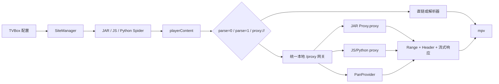

# FongMi 功能实现实施文档

更新时间：2026-08-17

本文是把当前 Electron + Python + JVM 项目逐步收敛到 FongMi/TVBox 运行时能力的实施方案。重点是：

1. 兼容 FongMi 的 JAR、JavaScript、Python Spider；
2. 播放普通直链、解析线路和网盘资源；
3. 支持 JAR 的本地 `Proxy.proxy()` 流式代理；
4. 支持夸克、UC、百度、天翼、123、迅雷等网盘 Provider；
5. 可选地增加“浏览我的网盘并选择视频”的桌面端功能。

本文的“实现 FongMi 功能”分为三个层级：

| 层级 | 目标 | 是否必须 |
|---|---|---|
| A | 播放配置源返回的网盘剧集 | 必须，第一阶段完成 |
| B | 兼容任意遵循 FongMi Spider/Proxy 契约的 JAR、JS、Python 源 | 必须，第二阶段完成 |
| C | 在桌面端直接浏览网盘目录、搜索文件、选择播放 | 可选，第三阶段完成 |

如果只需要“导入 TVBox 配置后播放夸克资源”，A 已经有基础；如果需要“像 FongMi 一样换仓库、换 JAR、换网盘仍然能工作”，必须完成 B。

## 1. 参考实现和当前项目

### 1.1 FongMi 的真实扩展方式

FongMi 主应用并没有把所有网盘 API 硬编码在 `app` 模块中。它依赖配置和外部 Spider JAR：

- `sites[].type/api/jar/ext` 决定站点和爬虫运行时；
- `playerContent(flag, id, vipFlags)` 返回播放结果；
- JAR 可以在播放 URL 中返回 `proxy://`；
- 本地 `/proxy` 接收 query、请求头、POST body，并转交给对应 Spider 的 `proxy()`；
- `proxy()` 返回状态码、MIME、`InputStream` 和可选响应头；
- 播放器消费本地代理输出的 HTTP 流。

上游契约文档：

- [FongMi README](https://github.com/FongMi/TV/blob/master/README.md)
- [Spider API](https://github.com/FongMi/TV/blob/master/docs/SPIDER.md)
- [本地 HTTP API](https://github.com/FongMi/TV/blob/master/docs/LOCAL.md)

本地对照代码：

- `TV-fongmi/app/src/main/java/com/fongmi/android/tv/api/loader/BaseLoader.java`
- `TV-fongmi/app/src/main/java/com/fongmi/android/tv/api/loader/JarLoader.java`
- `TV-fongmi/app/src/main/java/com/fongmi/android/tv/server/process/Proxy.java`
- `TV-fongmi/catvod/src/main/java/com/github/catvod/crawler/Spider.java`
- `TV-fongmi/catvod/src/main/java/com/github/catvod/Proxy.java`

### 1.2 当前项目的对应关系

| FongMi 组件 | 当前项目 | 状态 |
|---|---|---|
| `VodConfig` / `Site` | `python-backend/config.py` | 已有基本配置加载 |
| `JarLoader` | `python-backend/jar_bridge.py` + `jar-runner/SpiderRunner.java` | 已有，但运行时契约不完整 |
| QuickJS | `python-backend/js-engine/` | 已有 |
| Chaquopy Python | `python-backend/` Python Spider | 已有等价能力 |
| `SiteApi.playerContent` | `python-backend/server.py` + `jar_spider.py` | 已有基本调用 |
| NanoHTTPD `/proxy` | FastAPI `/proxy` + `go_proxy.py` | 已拆成两套，需统一 |
| ExoPlayer | mpv | HTTP 播放可替代，Android 专属能力不完全等价 |
| FongMi Pan JAR | 外部 JAR + 夸克 host 快路径 | 夸克可用基础，通用 JAR Proxy 未完成 |

当前配置、Spider、播放链路的总览见 [ARCHITECTURE.md](ARCHITECTURE.md)，差距审计见 [TVBOX_CONTRACT_GAPS.md](TVBOX_CONTRACT_GAPS.md)。

## 2. 目标架构

目标架构必须把“控制面”和“数据面”分开：

- 控制面：JSON-RPC/FastAPI，用于 `homeContent`、`detailContent`、`playerContent` 等短结果；
- 数据面：HTTP 流，用于 JAR `proxy()`、网盘下载、Range、长连接和取消。



### 2.1 进程边界

```text
Electron 主进程
  ├─ Python FastAPI 控制面：随机端口 + token
  ├─ 统一本地代理数据面：127.0.0.1:9978 起始端口
  ├─ JVM SpiderRunner：JAR 控制调用和 Proxy 流桥
  └─ mpv：最终播放器
```

建议保留当前 Python 后端随机控制端口，同时让代理端口从 9978 开始顺序探测。这样既兼容 FongMi 的硬编码端口习惯，也不会把播放器流量混进业务 API。

## 3. 功能边界

### 3.1 必须支持的 Spider 方法

所有运行时都应归一到以下方法：

```text
init(ext)
homeContent(filter)
homeVideoContent(pg)
categoryContent(tid, pg, filter, extend)
detailContent(ids)
searchContent(key, quick, pg)
playerContent(flag, id, vipFlags)
liveContent(url)
proxy(params)             # 数据面，不是 JSON 字符串结果
action(action)
isVideoFormat(url)
manualVideoCheck()
destroy()
```

其中 `proxy()` 是特殊方法：不能按普通 JSON 返回值处理。

### 3.2 必须支持的配置类型

第一阶段支持：

| type | api 形式 | 运行时 |
|---|---|---|
| 0 | HTTP URL | CMS/XML |
| 1 | HTTP URL | CMS/JSON/filter |
| 3 | `csp_ClassName` | JAR |
| 3 | `.js` URL | QuickJS |
| 3 | `.py` URL | Python |
| 4 | HTTP URL | JSON + Base64 ext |

`type=15/16`、drpy、HikerWeb、Android 原生引擎不能凭编号猜测实现。必须先取得真实配置和对应 FongMi 源码，再单独建立契约。

## 4. 当前关键差距

### 4.1 JAR Proxy 无法传输二进制流

当前 [SpiderRunner.java](../python-backend/jar-runner/SpiderRunner.java) 在处理所有方法时执行：

```java
Object result = invoke(spider, cls, method, params);
String resultStr = (result == null) ? "null" : String.valueOf(result);
```

这可以传输 JSON 字符串，但无法传输 FongMi `proxy()` 的：

```java
Object[] { statusCode, mimeType, InputStream, headers }
```

更重要的是，FongMi 的 JAR Proxy 通常位于静态类：

```text
com.github.catvod.spider.Proxy.proxy(Map<String, String>)
```

而不是当前项目只尝试调用 Spider 实例的 `proxy(String)`。

### 4.2 9978 代理被拆成两条链路

当前：

- FastAPI `/proxy`：调用 `site.runner.localProxy()`；
- `go_proxy.py:9978`：处理 `do=ck`、`do=pan`、`url=` 直链转发；
- 二者之间没有完整的 FongMi `BaseLoader.proxy()` 调度。

结果是：

- 夸克专用快路径可以工作；
- 依赖 JAR 自定义 `Proxy.proxy()` 的其他网盘源可能无法工作；
- JS/Python `do=js/py` 和无 `siteKey` 的 JAR Proxy 语义不完整。

### 4.3 FastAPI 当前代理结果不能保证流式

当前 [server.py](../python-backend/server.py) 的 `build_proxy_response()` 主要处理字符串、JSON、字节内容和 `requests.Response.content`。FongMi 需要的是：

- 直接转发 `InputStream`/可读对象；
- 不缓存整部视频；
- 透传 Range、Content-Length、Content-Range、Accept-Ranges；
- 客户端断开后取消上游请求。

### 4.4 `playerContent` 字段还不完整

当前播放器请求使用空 `vipFlags`，并主要消费 `url/parse/header`。需要补齐：

- `jx=1` 与 `parse=1` 等价；
- `playUrl` 的 `json:`、`parse:` 前缀；
- `flag`、`jxFrom`；
- `click`；
- `format`；
- `subs`、`drm`、`position` 等可选字段。

### 4.5 Cookie 字段不等于 Provider 能力

当前界面已经提供夸克、UC、天翼、百度、123、迅雷 Cookie 字段，但 host 侧直接实现的 API 主要是夸克。其他网盘应优先通过对应 FongMi JAR 的 Provider + Proxy 工作，不能仅凭“输入框存在”宣称已支持。

### 4.6 远程网盘浏览未实现

当前“本地文件”页面只管理本机目录。若要实现远程网盘浏览，需要新增 Provider API、目录数据模型、分页、搜索、缓存和 UI；这不是 `playerContent` 的自然延伸，应作为独立阶段。

## 5. P0：统一本地代理网关

这是整个项目最重要的改造。没有它，普通夸克快路径可以工作，但不能称为 FongMi 兼容。

### 5.1 建议新增模块

```text
python-backend/proxy_gateway.py
python-backend/proxy_contract.py
python-backend/tests/test_proxy_gateway.py
python-backend/tests/fixtures/proxy-spider/
```

`go_proxy.py` 保留为网盘 HTTP 传输实现，但不再独占 FongMi 代理入口。

### 5.2 代理请求格式

统一入口：

```http
GET http://127.0.0.1:9978/proxy?siteKey=quark&do=pan&url=...
Range: bytes=0-1048575
User-Agent: ...
Referer: ...
Cookie: ...
```

请求参数来源必须合并：

1. Query String；
2. HTTP 请求头；
3. POST 表单或请求体；
4. 内部上下文，例如 `siteKey`、当前配置 ID、请求取消信号。

### 5.3 调度矩阵

| 条件 | 调用目标 |
|---|---|
| `siteKey` 存在 | `sites.get(siteKey).runner.localProxy(params)` |
| `do=js` | 当前最近 JS Spider 的 `proxy(params)` |
| `do=py` | 当前最近 Python Spider 的 `proxy(params)` |
| 其他 | 当前最近 JAR 的静态 `com.github.catvod.spider.Proxy.proxy(params)` |
| `do=pan` | `PanProviderRegistry`，必要时回退夸克实现 |
| `do=ck` | 返回 `ok` |

此逻辑应与 FongMi `BaseLoader.proxy()` 的优先级一致。参考：[BaseLoader.java](../TV-fongmi/app/src/main/java/com/fongmi/android/tv/api/loader/BaseLoader.java)、[JarLoader.java](../TV-fongmi/app/src/main/java/com/fongmi/android/tv/api/loader/JarLoader.java)。

### 5.4 内部响应对象

Python 侧统一使用一个内部对象，不直接散落 tuple：

```python
class ProxyResult:
    status: int
    mime: str
    body: object       # file-like / iterator / async iterator
    headers: dict[str, str]
    close: callable | None
```

允许的 body 类型：

- `requests.Response.raw`；
- 具有 `read()` 的对象；
- 同步迭代器；
- 异步迭代器；
- 小型错误文本或 JSON。

视频主体不能转成 `bytes` 后一次性读入内存。

### 5.5 HTTP 响应要求

至少支持：

```text
200 OK
206 Partial Content
302 Found
400 Bad Request
401 Unauthorized
403 Forbidden
404 Not Found
416 Range Not Satisfiable
502 Bad Gateway
```

允许透传的响应头：

```text
Content-Type
Content-Length
Content-Range
Accept-Ranges
Location
Cache-Control
ETag
Last-Modified
Content-Disposition
```

`Set-Cookie`、`Authorization`、内部调试头默认禁止向浏览器层透传，除非 Provider 明确声明需要。

### 5.6 代理 URL 归一化

所有 Spider 返回的以下形式都应归一到统一 HTTP URL：

```text
proxy://...
http://127.0.0.1:9978/proxy?...
http://127.0.0.1:7944/?url=...
http://127.0.0.1:1314/?url=...
```

建议建立：

```python
normalize_proxy_url(url, site_key, spider_type) -> str
```

规则：

1. `proxy://` 转换为当前代理地址；
2. 没有 `siteKey` 的地址由生成方补充签名上下文；
3. 已知旧端口 7944/9978/1314 保持兼容；
4. 新端口不允许把 FastAPI 控制端口当成媒体代理端口；
5. URL 参数使用严格 URL 编码，不能重复 `unquote_plus`。

## 6. P0：JAR 运行时补全

### 6.1 增加 CatVod 基础类

当前 `jar-runner/stubs` 是部分 Android/Spider Stub。需要补齐至少这些运行时入口：

```text
com.github.catvod.Proxy
com.github.catvod.crawler.Spider
com.github.catvod.crawler.SpiderDebug
com.github.catvod.spider.Init
com.github.catvod.utils.Json
com.github.catvod.utils.Util
com.github.catvod.utils.Path
```

补齐原则：

- 方法签名优先与 `TV-fongmi/catvod` 保持一致；
- 不实现无意义的空成功返回；
- 缺失功能必须抛出可诊断异常；
- 所有 PC 特有行为通过桥接实现，不把 Android Context 假装成完整 Android。

### 6.2 `com.github.catvod.Proxy` Stub

建议提供：

```java
public final class Proxy {
    public static int getPort() { ... }
    public static String getUrl(boolean local) { ... }
}
```

端口由 JVM 参数或环境变量注入：

```text
-Dvpc.proxyHost=127.0.0.1
-Dvpc.proxyPort=9978
```

不能让 JAR 自己硬编码 PC 后端随机端口。

### 6.3 静态 `com.github.catvod.spider.Proxy`

JAR 加载时执行：

```java
Class<?> proxyClass = loader.loadClass("com.github.catvod.spider.Proxy");
Method method = proxyClass.getMethod("proxy", Map.class);
```

在 PC Runner 中保存每个 JAR 的静态 Proxy 方法，并在统一 `/proxy` 请求到达时调用。

不要把 `InputStream` 转成 `String`。推荐新增“长度前缀二进制帧”桥：

```text
请求帧：4 字节 JSON 长度 + JSON 参数
响应帧：4 字节 Header JSON 长度 + Header JSON
        8 字节状态/长度信息
        连续媒体数据块
        EOF 帧
```

要求：

- 每个请求都有 request ID；
- 可同时处理多个 Range 请求；
- Python 客户端断开时通知 JVM 关闭 InputStream；
- JVM 异常必须转成明确的 HTTP 502/错误信息；
- 不把媒体流写入临时文件作为默认方案。

### 6.4 JAR 兼容性分层

| 级别 | 说明 | 行为 |
|---|---|---|
| L0 | 标准 JVM JAR，无 Android 特殊依赖 | 直接运行 |
| L1 | 依赖常用 CatVod/Android API | 通过 Stub 运行 |
| L2 | 依赖 Android UI、WebView、系统服务 | 标记不支持并给出原因 |
| L3 | 依赖 `.so/.aar` 原生引擎 | 使用独立适配器或跳过 |
| L4 | 依赖 DRM、设备绑定、硬件能力 | 明确告知桌面端限制 |

特别是 `thunder`、`forcetech`、`tvbus`、`jianpian` 等 Android 原生模块，不能仅复制 Java 文件就认为已经支持。

## 7. P1：统一播放结果和解析路由

### 7.1 归一化 Result

在 Python 后端增加：

```python
normalize_play_result(raw, site, flag, original_id) -> PlayResult
```

推荐内部结构：

```json
{
  "url": "...",
  "parse": 0,
  "jx": 0,
  "playUrl": "",
  "header": {},
  "flag": "线路名",
  "jxFrom": "",
  "click": "",
  "format": "",
  "subs": [],
  "drm": null,
  "position": 0,
  "error": ""
}
```

兼容规则：

- `jx == 1` 时强制 `parse = 1`；
- `url` 为空时不要静默回退为原始 ID；
- `header` 支持对象和 JSON 字符串；
- Header key 大小写归一化，但不覆盖 Spider 明确返回的值；
- 站点 Header、Spider Header、解析器 Header 按明确优先级合并；
- `format` 传入 mpv 前不能丢失；
- 不认识的字段保留在诊断结果中，不能直接删除。

### 7.2 传入正确的 `vipFlags`

当前渲染层将 `vipFlags` 传为空数组。应改成：

```text
config.flags -> action(playerContent) -> Runner -> JAR/JS/Python
```

必须覆盖以下测试：

- 空 flags；
- 单个 flag；
- 多个 flag；
- 当前线路匹配 flag；
- 当前线路不匹配 flag 时的降级行为。

### 7.3 `playUrl` 路由

实现以下语义：

```text
json:<url>       使用指定 JSON 解析器
parse:<name>     使用配置中指定名称的解析器
其他前缀         作为播放 URL 前缀拼接
空值             使用默认解析器或直接播放
```

解析器类型建议按 FongMi 契约建立行为测试：

```text
type 0：WebView / 页面嗅探
type 1：JSON 解析接口
type 2：扩展 JSON
type 3：混合解析
type 4：并发尝试多个解析器
```

### 7.4 播放器限制

mpv 可以很好地播放 HTTP、HLS、部分 DASH 和带 Header 的视频，但不能自动等价于 Android ExoPlayer 的：

- Widevine/PlayReady 设备 DRM；
- Android Surface/TextureView；
- Android Auto；
- 某些原生 `.so` 解码器。

这些能力必须在产品文档中标注为“桌面端不支持”或另建适配器，不能误报为 FongMi 完整等价。

## 8. P1：网盘 Provider 层

### 8.1 抽象接口

建议新增：

```text
python-backend/pan/
  __init__.py
  models.py
  registry.py
  base.py
  quark.py
  uc.py
  baidu.py
  tianyi.py
  p123.py
  xunlei.py
```

统一接口：

```python
class PanProvider:
    name: str
    key: str

    def validate_cookie(self, cookie: str) -> list[str]: ...
    def resolve_share(self, url: str, *, headers: dict) -> ShareInfo: ...
    def list_files(self, request: ListFilesRequest) -> FilePage: ...
    def resolve_play_url(self, file: PanFile, *, headers: dict) -> PlayUrl: ...
    def refresh_play_url(self, play: PlayUrl) -> PlayUrl: ...
```

### 8.2 Quark 迁移策略

当前 `go_proxy.py` 中的 `_quark_*` 函数已经包含可复用逻辑：

- 分享 token/detail；
- 首个视频文件选择；
- 分享转存；
- `v2/play`；
- `file/download`；
- CDN 流式转发。

迁移顺序：

1. 先抽成 `pan/quark.py`；
2. `go_proxy.py` 只负责 HTTP 传输和 Range；
3. `do=pan` 通过 `PanProviderRegistry` 调度；
4. 保留旧参数格式作为兼容入口；
5. 删除 `JarSpider` 中与某个特定 vodId 格式强绑定的长期特判，只保留可开关的兼容快路径。

### 8.3 其他 Provider

每个 Provider 分成两种能力：

| 能力 | 说明 |
|---|---|
| JAR Provider | 由外部 FongMi JAR 完成登录、分享解析和取流；宿主只负责契约 |
| Native Provider | 宿主直接实现 API，适合 API 稳定且有明确授权的网盘 |

建议顺序：

1. 夸克：复用现有实现；
2. UC：与夸克部分接口相似，但 Cookie 和域名不能混用；
3. 百度：优先兼容 JAR，`BDUSS` 仅作为用户凭据，不在日志中输出；
4. 天翼/123/迅雷：先通过 JAR Proxy 验证，再决定是否增加 native adapter。

不要为了“支持列表里有六个名字”而实现一组没有真实接口测试的空 Provider。

### 8.4 签名 URL 缓存

网盘播放 URL 通常有过期时间。缓存模型：

```text
cache key = provider | account fingerprint | file id | quality
value     = signed URL + expireAt + required headers
```

要求：

- 播放前检查过期时间；
- 过期前提前刷新；
- 收到 401/403 时只重试一次；
- 同一文件并发刷新使用 single-flight；
- 不把完整 Cookie 写入播放记录或错误日志。

## 9. P2：远程网盘浏览功能

只有当产品需要“直接浏览我的网盘”时才实施本节。

### 9.1 后端接口

建议增加带 token 的 API：

```http
GET  /pan/providers
GET  /pan/{provider}/root
GET  /pan/{provider}/list?parentId=...&page=1&pageSize=50
GET  /pan/{provider}/search?q=...&page=1
POST /pan/{provider}/resolve
POST /pan/{provider}/refresh
```

统一文件对象：

```json
{
  "provider": "quark",
  "id": "fid",
  "parentId": "parent-fid",
  "name": "episode-01.mp4",
  "isDir": false,
  "size": 123456789,
  "mime": "video/mp4",
  "updatedAt": "2026-08-17T00:00:00Z",
  "playable": true
}
```

### 9.2 UI

建议新增“网盘”视图，不要把远程网盘混入“本地文件”：

- Provider 选择；
- 登录状态；
- 根目录/面包屑；
- 文件夹进入；
- 视频后缀筛选；
- 关键字搜索；
- 分页和虚拟列表；
- 播放、复制链接、刷新链接；
- 过期/未登录/无权限状态。

### 9.3 播放 ID

远程网盘文件不要把完整 Cookie 或短期签名 URL 写进 `vodId`。推荐只保存：

```json
{
  "provider": "quark",
  "fileId": "fid",
  "shareId": "",
  "parentId": ""
}
```

播放时再由 Provider 解析成短期 URL。

## 10. 安全要求

网盘 Cookie 等价于登录凭据，必须作为高敏感数据处理。

### 10.1 代理安全

- 代理只绑定 `127.0.0.1`；
- 9978 数据面增加随机 token 或一次性签名；
- 保留 Origin/Sec-Fetch 防护，但不能把它当作唯一鉴权；
- 禁止任意 URL SSRF；
- 目标域名必须通过 Provider 白名单或明确的 Spider 授权；
- 禁止把 Cookie 自动附加到非网盘域名；
- 限制最大并发、最大 Range、最大请求体和最大连接时长。

### 10.2 凭据存储

当前 Cookie 存储逻辑位于 `python-backend/pan_cookies.py`。生产版建议：

- Windows 使用 Electron `safeStorage` 或 DPAPI 加密；
- Python 后端只接收短时解密结果；
- 日志统一脱敏 `Cookie/BDUSS/__pus/Authorization`；
- 清空账号时同时清理签名 URL 缓存；
- 不把 Cookie 放进测试 fixture、Git、崩溃报告或 JAR 参数日志。

### 10.3 外部 JAR 风险

加载 JAR 等价于执行第三方代码。建议：

- 对下载内容做 HTTPS、大小、类型和哈希校验；
- JAR 使用独立 JVM 子进程；
- 限制 JVM 工作目录和写入目录；
- 禁止第三方 JAR 访问 Electron IPC；
- 记录 JAR 来源和版本；
- 对异常、超时、内存和线程数设置上限。

### 10.4 DRM 和版权边界

本文只讨论用户有权访问的网盘文件、公开内容和合法授权的播放源。不得通过绕过 DRM、破解账号或规避服务商访问控制来实现播放。

## 11. 测试方案

### 11.1 单元测试

新增：

```text
python-backend/tests/test_proxy_contract.py
python-backend/tests/test_proxy_stream.py
python-backend/tests/test_pan_provider.py
python-backend/tests/test_play_result.py
tests/js/player-contract.test.js
```

覆盖：

- `proxy://` URL 归一化；
- `siteKey/do=js/do=py/do=pan` 调度；
- 200/206/302/416；
- Range 越界；
- Header 合并；
- 上游断开；
- JAR Proxy 异常；
- Cookie 白名单；
- Provider 签名 URL 过期刷新；
- `jx/parse/playUrl/vipFlags`。

### 11.2 JAR 夹具

制作一个最小测试 JAR，包含：

```java
public class Proxy {
    public static Object[] proxy(Map<String, String> params) {
        return new Object[]{
            200,
            "video/mp4",
            new ByteArrayInputStream(TEST_BYTES),
            Map.of("Accept-Ranges", "bytes")
        };
    }
}
```

测试要求：

1. `playerContent()` 返回本地 `proxy://`；
2. 播放器请求 0-1 字节得到 206；
3. 请求不同 Range 得到对应内容；
4. 客户端关闭后 Java `InputStream` 被关闭；
5. 代理响应头不丢失；
6. JAR 静态 Proxy 而非 Spider 实例方法也能工作。

### 11.3 JS/Python 代理夹具

分别实现：

```text
JS proxy(params) -> [200, "video/mp4", body, headers]
Python localProxy(params) -> 同等结构
```

验证 `do=js`、`do=py` 与 `siteKey` 路由不互相污染。

### 11.4 真实网络验收

必须使用用户自己的账号和合法资源：

| 场景 | 预期 |
|---|---|
| 夸克分享视频 | 能解析并播放 |
| 夸克个人文件 fid | 能直接取流 |
| Cookie 缺失 | 快速提示，不死等 |
| Cookie 过期 | 401/403 后只重试一次 |
| mpv 拖动进度 | Range 正常，不能从头下载 |
| 4K 大文件 | 不整文件读入内存 |
| JAR 自定义 Proxy | 能流式播放 |
| JS/Python 自定义 Proxy | 能流式播放 |
| 9978 被占用 | 自动换端口并同步给 Spider |
| 多站点并发 | Cookie、recent JAR、错误信息不串站 |

## 12. 分阶段任务清单

### Phase 0：冻结契约和基线

- [ ] 保存当前可工作的夸克快路径行为；
- [ ] 固定 `playerContent`、`/action`、`/proxy` 的请求/响应样例；
- [ ] 建立 JAR、JS、Python 三种代理夹具；
- [ ] 记录当前测试基线和真实网络测试账号要求；
- [ ] 明确桌面端不支持的 Android 原生模块。

### Phase 1：统一代理数据面

- [ ] 新增 `proxy_contract.py`；
- [ ] 新增 `proxy_gateway.py`；
- [ ] 把 9978/7944/1314 旧协议接入统一调度；
- [ ] 增加 `StreamingResponse` 和断开取消；
- [ ] 增加 `siteKey/do=js/do=py/do=pan` 路由；
- [ ] 增加代理 token/签名；
- [ ] 完成 JAR/JS/Python 代理夹具。

### Phase 2：补齐 JAR Proxy

- [ ] 增加 `com.github.catvod.Proxy` Stub；
- [ ] 增加静态 `com.github.catvod.spider.Proxy` 加载；
- [ ] 增加二进制流桥；
- [ ] 增加 JVM 请求取消和超时；
- [ ] 补齐常用 CatVod Stub；
- [ ] 对 DEX/JVM JAR 做兼容性分级。

### Phase 3：播放契约

- [ ] 传递真实 `vipFlags`；
- [ ] 实现 `jx/parse/playUrl`；
- [ ] 完善 Header 合并；
- [ ] 保留 `format/subs/drm/position`；
- [ ] 增加多解析器并发和优先级测试；
- [ ] 对 mpv 不支持的 DRM 明确报错。

### Phase 4：Provider

- [ ] 抽取 `PanProvider`；
- [ ] 抽取 Quark；
- [ ] 接入 UC；
- [ ] 验证百度、天翼、123、迅雷的 JAR Proxy；
- [ ] 增加签名 URL 缓存和 single-flight 刷新；
- [ ] 加密 Cookie。

### Phase 5：远程网盘浏览

- [ ] `/pan/providers`；
- [ ] 目录列表和分页；
- [ ] 搜索；
- [ ] 文件详情和播放；
- [ ] 登录状态和过期状态；
- [ ] 桌面端网盘 UI；
- [ ] 远程网盘历史记录只保存稳定文件 ID。

## 13. Definition of Done

### FongMi 兼容播放完成

满足以下条件才可以标记完成：

- [ ] 一个标准 JAR 的静态 `Proxy.proxy(Map)` 可以被调用；
- [ ] `InputStream` 不经过 JSON 字符串化；
- [ ] 9978 `/proxy` 能将所有参数、请求头和 POST body 传给 Spider；
- [ ] 200/206/302/416 和 Range 播放行为正确；
- [ ] JAR/JS/Python 三种代理夹具全部通过；
- [ ] `playerContent` 的 `parse/jx/playUrl/header/vipFlags` 行为通过；
- [ ] 夸克分享和个人文件可以真实播放；
- [ ] Cookie 失效时不会卡死或泄漏；
- [ ] 多站点并发时不会串 Cookie、串 JAR 或串错误。

### 远程网盘浏览完成

另外满足：

- [ ] 能列出根目录和子目录；
- [ ] 能分页、搜索和筛选视频；
- [ ] 只保存稳定文件 ID，不保存短期签名 URL；
- [ ] 播放前动态生成 URL；
- [ ] 过期 URL 能自动刷新；
- [ ] 登录、权限、空目录、网络错误都有明确 UI 状态。

## 14. 推荐实际执行顺序

不要先做远程网盘 UI，也不要先增加更多 Provider。正确顺序是：

```text
代理契约
  → JAR 静态 Proxy
  → 二进制流桥
  → Range/Header
  → playerContent 完整字段
  → Quark Provider 抽取
  → 其他 Provider
  → 远程网盘 UI
```

原因是：只要通用 Proxy 契约没有完成，新增百度、UC 或迅雷代码仍然会在播放数据面失败；只要播放器字段没有统一，换源和解析器行为仍然会不稳定。

## 15. 当前文件与实施入口

### 首批修改入口

- `python-backend/server.py`：统一 `/proxy` 调度和流式响应；
- `python-backend/go_proxy.py`：保留通用 Range 转发，抽取 Quark Provider；
- `python-backend/jar_spider.py`：去除长期特定 vodId 假设，保留兼容快路径；
- `python-backend/jar_bridge.py`：JVM 启动参数、端口和流桥；
- `python-backend/jar-runner/SpiderRunner.java`：静态 Proxy 和二进制桥；
- `python-backend/jar-runner/stubs/`：CatVod/Android 常用 Stub；
- `src/renderer/js/player.js`：完整播放结果和 flags；
- `src/main/mpv-player.js`：Header、Range、缓存和错误映射；
- `src/renderer/js/panels.js`：网盘账号和远程网盘入口；
- `python-backend/pan_cookies.py`：凭据加密和过期管理。

### 相关现有文档

- [系统架构](ARCHITECTURE.md)
- [TVBox 兼容性计划](TVBOX_COMPAT_PLAN.md)
- [TVBox 剩余工作计划](TVBOX_COMPAT_PLAN_REMAINING.md)
- [FongMi 契约差距审计](TVBOX_CONTRACT_GAPS.md)
- [数据地图](DATA_MAP.md)

本文件只定义实现路径，不把尚未完成的真实网络、JAR 和 Provider 验收标记为已支持。
