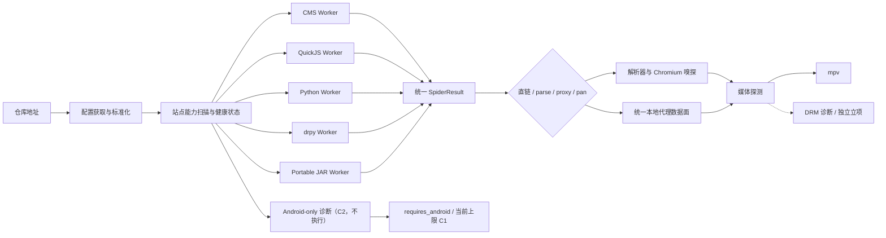
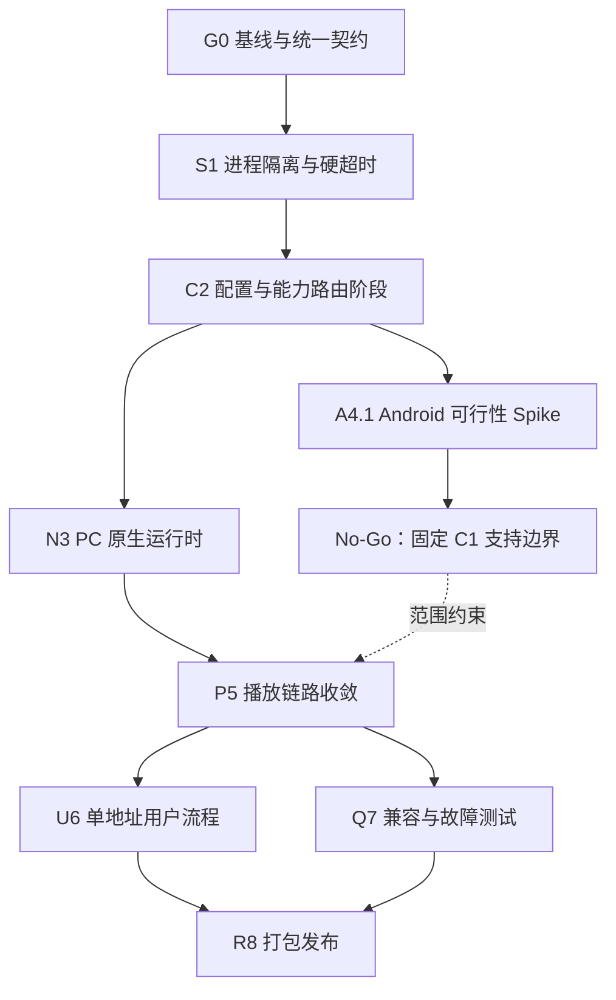

# TVBox / FongMi 功能一致性详细任务书

- **编写日期**：2026-08-18
- **最近决策**：2026-08-19（2026-08-22 核验：与当前项目实际一致，无需变更）
- **状态**：G0.1-G0.3、S1.1-S1.4、C2.1-C2.5 验收通过；A4.1 已完成并作出 No-Go，A4.2-A4.5 关闭
- **目标平台**：Windows 优先，macOS/Linux 在 PC 原生运行时稳定后跟进
- **正式产品目标**：C1 PC 原生兼容。用户只输入一个影视仓库地址，应用自动获取配置、识别并加载 C1 可运行站点，最终成功播放用户有权访问的媒体
- **相关文档**：[系统架构](ARCHITECTURE.md) | 当前状态见 [PROGRESS.md](../PROGRESS.md)

本文不重复已经完成的配置解析、代理、网盘和播放器补丁，而是定义从当前状态走到“使用体验接近 TVBox/FongMi”的完整执行路径。本文中的任务完成状态必须以测试证据为准，不能以“代码已写”或“仓库能导入”代替验收。

本任务书的产品与发布决策以 **C1 为唯一正式目标**：C2 仅保留为 Android-only
源的诊断分类，不代表当前产品承诺、可选运行模式或后续默认路线。任何 Android guest、
设备或远程 Worker、JVM Android shim 的重新立项，都必须另行提交 ADR、任务书、原型证据、
安全/许可/资源预算并获得明确授权；不得仅通过环境变量、隐藏开关或恢复 A4.2-A4.5 待办来
扩大支持上限。

---

## 1. 最终目标与边界

### 1.1 用户最终流程

目标用户流程必须保持简单：

1. 用户在设置页粘贴一个仓库地址；
2. 应用自动完成 IDN、重定向、压缩、图片伪装、多仓和相对路径处理；
3. 应用读取仓库配置并建立站点清单；
4. 每个站点根据能力自动路由到 CMS、JavaScript、Python、drpy 或可移植 JVM JAR；Android-only 源只做 C2 诊断并准确提示当前不支持；
5. 首页、分类、搜索和详情只展示健康或可明确降级的站点；
6. 点击剧集后自动执行 `playerContent`、解析器、本地代理和请求头合并；
7. 播放器收到可验证的媒体地址并成功加载首帧；
8. 任一环节失败时，界面准确显示失败层级和建议，不出现永久加载、空白页或假成功。

用户不应被要求理解 JAR、QuickJS、drpy、解析器或代理端口。运行时选择属于宿主内部实现。

### 1.2 兼容等级

| 等级 | 定义 | 本计划定位 |
|---|---|---|
| C0 配置兼容 | 能下载并解析配置，但站点不一定能运行 | 仅诊断能力，不算产品完成 |
| C1 PC 原生兼容 | CMS、CatVod JS/Python、drpy、可移植 JVM JAR 可稳定运行和播放 | **唯一正式产品、验收与发布目标** |
| C2 混合运行时兼容 | 在 C1 之上运行 Android/Dex/native JAR；当前实现仅识别其依赖并标记 C2 | 非当前产品目标；Android-only 不可运行、不计 healthy |
| C3 平台完全等价 | Android 原生 ABI、DRM 和平台专属播放器能力 | 范围外，无排期或交付承诺 |

“与 TVBox/FongMi 一致”在本项目中限定为 **C1 可移植运行时范围内**的配置、Spider、
解析、代理和播放契约行为一致，不代表 Android 源覆盖率、界面像素级一致，也不承诺已经
失效、地区封锁、需要私有账号或服务端故障的第三方源一定可用。C1 完成必须以
`init/home/category/detail/search/player/proxy`、媒体探测和播放器首帧的端到端证据为准，
不能用配置导入成功、站点对象创建或返回 URL 代替。

### 1.3 必须实现

- 单仓、多仓、注释 JSON、gzip、图片伪装、中文域名、相对资源和仓库跳转；
- CMS、CatVod JavaScript、Python、drpy 和可移植 JAR；
- Android 依赖源的明确识别、C2 诊断标记和 `L2_SITE_REQUIRES_ANDROID` 用户提示；不得路由到未发布的 Worker，也不得回退 dex2jar/JVM 制造假兼容；
- `init/home/category/detail/search/player/proxy` 契约；
- `parse/jx/playUrl/header/cookie/subs/format/position` 播放结果归一；
- HTTP 重定向、Range、HLS、请求头、本地代理和流式转发；
- 调用级硬超时、熔断、重启、资源限额和取消；
- 以播放器首帧或 `file-loaded` 为播放成功标准；
- 可重复执行的离线契约测试、真实仓兼容测试和打包后实机测试。

### 1.4 不在本任务书目标

- 对已经失效或要求未知私有令牌的公共仓提供可用性保证；
- 绕过付费、授权、地域或 DRM 限制；
- 在普通 Windows JVM 中直接运行 ARM Android `.so`；
- 打包 Android guest/emulator、配套 Android 设备 Worker、自托管远程 Android Worker 或 JVM Android shim；
- 用按仓库名、JAR 哈希或作者名编写的长期特判维持兼容；
- C3 级 Widevine/PlayReady 播放，除非完成单独的安全、许可和发布评估。

---

## 2. 当前基线与已确认根因

### 2.1 已有基础

当前项目已经具备：

- 配置下载、图片伪装、gzip、IDN、多仓与基本相对路径处理；
- CMS、Python Spider、QuickJS Spider 和普通 JVM JAR 桥；
- CatVod 六方法入口及 `/proxy` 基础能力；
- `parse=1`、隐藏 BrowserWindow 嗅探、请求头合并；
- mpv 播放、首播等待、连播、断流重连、历史和观看统计；
- 夸克 Provider 快路径、Cookie 管理和代理流式转发；
- L1-L4 分层错误与一批契约测试。

2026-08-18 本轮验证结果：

- Python 完整回归通过；
- JavaScript 单元测试 216/216 通过；
- 代表性真实仓库可以获取并解析配置；
- 真实仓库中的 Android API、DEX 和 native-library JAR 在普通 JVM 路径出现 `DexNative` 初始化失败；
- drpy 站点被当前配置层明确跳过；
- 真实首页探测超过三分钟仍未退出，说明线程取消不是硬终止边界。

### 2.2 主要根因

| 编号 | 根因 | 当前表现 | 影响 |
|---|---|---|---|
| B1 | 运行时不等价 | FongMi 使用 Android `DexClassLoader`，当前使用 dex2jar + 普通 JVM | Android Context、二次 DEX、WebView、ARM `.so` 源失败 |
| B2 | drpy 缺失 | 配置能解析，但 drpy 站点直接 skipped | 新仓库大量主要站点不可用 |
| B3 | 缺少可终止隔离 | Future 超时或 cancel 后底层线程仍运行 | 永久加载、退出等待、资源泄漏 |
| B4 | 健康状态过早 | 站点对象建成即计入成功，首次调用才暴露 JAR 初始化失败 | “导入成功但首页为空”的假成功 |
| B5 | FongMi 字段语义不完整 | HTTP `ext`、`playUrl/jx/flags`、解析器类型仍有差距 | 首页或播放行为与 FongMi 不一致 |
| B6 | 播放成功口径偏弱 | 获得 URL 或启动进程容易被当成成功 | HTML、403、过期 CDN 地址仍显示正在播放 |
| B7 | 外部源天然不稳定 | CDN、域名、令牌、账号和地域随时变化 | 不能只靠一次公共仓测试判断宿主正确性 |

### 2.3 必须改变的工程原则

1. **导入成功不等于兼容成功**：配置、建站、运行、解析、媒体探测、首帧必须分别计数。
2. **线程不是安全隔离边界**：远程 JS、Python、JAR 和 drpy 必须运行在可终止进程中。
3. **先识别能力，再选择运行时**：不能把 Android-native JAR 继续盲目交给普通 JVM。
4. **修契约，不修仓库名**：新增补丁必须对同类型的其他仓库有效。
5. **公共仓只做趋势测试**：确定性回归必须依赖本地夹具和可控测试服务。
6. **首帧才是播放成功**：`playerContent` 返回 URL、解析成功或 mpv 进程启动都只是中间状态。

---

## 3. 目标架构



### 3.1 控制面与数据面

- **控制面**：短 JSON 请求，承载配置、健康状态和 Spider 方法；每个调用有 deadline、requestId 和结构化错误。
- **数据面**：视频、HLS 分片和 JAR/网盘代理流；支持 Range、取消和客户端断连传播，不能经过 JSON 或整流入内存。
- **Supervisor**：创建、复用、停止和重启各类 Worker；记录队列、超时、崩溃和熔断状态。
- **Capability Router**：根据站点类型、API、JAR 扫描结果和运行探测选择 Worker，不依赖仓库名称。

### 3.2 Worker 最小协议

所有运行时至少实现以下请求：

```json
{
  "requestId": "uuid",
  "siteKey": "site-key",
  "method": "playerContent",
  "deadlineMs": 30000,
  "args": {
    "flag": "line-name",
    "id": "episode-id",
    "vipFlags": []
  }
}
```

统一响应：

```json
{
  "requestId": "uuid",
  "ok": true,
  "runtime": "jar",
  "elapsedMs": 1842,
  "result": {},
  "error": null
}
```

错误响应必须包含：

```json
{
  "code": "L3_RUNTIME_TIMEOUT",
  "stage": "runtime",
  "retryable": true,
  "siteKey": "site-key",
  "runtime": "jar",
  "message": "源响应超时，运行时已重启"
}
```

---

## 4. 总体验收口径

### 4.1 分阶段状态

| 阶段 | 名称 | 成功条件 | 失败示例 |
|---|---|---|---|
| S0 | 仓库获取 | 在限制大小和跳转次数内取得非空配置内容 | DNS、TLS、403、超时 |
| S1 | 配置解析 | 生成合法标准配置模型 | JSON/编码/伪装解码失败 |
| S2 | 站点装配 | 找到对应运行时并完成 `init` 或预检 | 类型不支持、JAR 不兼容 |
| S3 | 内容调用 | 首页、搜索、详情返回合法结构 | 空结构、异常、硬超时 |
| S4 | 播放路由 | `playerContent` 归一为直链、解析或代理任务 | URL 为空、字段冲突 |
| S5 | 媒体可达 | 使用最终请求头完成媒体探测 | HTML、403、Range 错误 |
| S6 | 播放就绪 | mpv/目标内核报告 `file-loaded` 或首帧 | 启动失败、加载超时 |

### 4.2 C1 发布级硬指标

- 只有 CMS、CatVod JS/Python、drpy 和 portable JAR 的 C1 端到端链路计入产品能力；
- Android-only 源必须稳定识别、准确提示且绝不计为 healthy 或尝试普通 JVM；
- 所有离线契约夹具 100% 通过；
- 任意 Worker 无限循环或阻塞时，必须在 deadline 后被终止，主进程不等待其自然退出；
- 单个坏源不能拖慢其他站点，也不能让应用退出卡住；
- 连续加载 20 次配置后，Worker、JVM、端口和临时目录数量回到稳定水位；
- 直链、`parse=1`、`proxy://`、HLS Range、带 Referer/Cookie 和网盘样例均完成首帧验收；
- 公共仓报告必须区分“宿主回归”和“上游不可达”，不能用外网波动掩盖确定性测试失败；
- UI 不允许以站点对象存在、URL 非空或播放器进程已创建作为最终成功提示。

### 4.3 默认调用预算

| 调用 | 默认 deadline | 超时动作 |
|---|---:|---|
| `init` | 30 秒 | 终止 Worker，站点标记不可用 |
| `homeContent` | 15 秒 | 取消请求；连续失败进入熔断 |
| `categoryContent` | 20 秒 | 取消请求；保留已加载页面 |
| `searchContent` | 20 秒 | 单源失败不影响其他源 |
| `detailContent` | 20 秒 | 取消请求并显示源级错误 |
| `playerContent` | 30 秒 | 终止本次播放链，不进入解析器 |
| JSON 解析接口 | 15 秒 | 尝试下一解析器 |
| WebView 嗅探 | 20 秒 | 关闭窗口和 partition 任务 |
| mpv 首次加载 | 30 秒 | 停止进程并返回明确失败原因 |

站点配置中的合法 `timeout` 可以在安全上限内覆盖默认值；任何远程配置都不能取消宿主硬上限。

---

## 5. 任务依赖与里程碑



| 里程碑 | 内容 | 完成定义 |
|---|---|---|
| M1 稳定宿主 | G0 + S1 | 坏源不再卡死、退出不等待、错误可定位 |
| M2 C1 契约完成 | C2 配置阶段 + N3 + P5 | CMS/JS/Python/drpy/portable JAR 完成端到端播放，Android-only 准确拒绝 |
| M3 C1 可发布 | U6 + Q7 + R8 | C1 安装包冷启动和真实播放矩阵通过，支持安全回滚 |

> 本文阶段编号 `C2` 指“配置标准化与能力路由”工作包，不等于兼容等级 C2，也不改变
> C1 正式产品目标。A4.1 只提供边界决策证据，不是通往发布版 Android Worker 的依赖。

---

## 6. G0：基线、契约与诊断

### G0.1 固化当前兼容基线

**优先级**：P0  
**依赖**：无

工作内容：

- 保留 21 仓公共语料，同时增加不依赖公网的本地仓库夹具；
- 修复兼容套件在首页 Future 超时后仍等待线程退出的问题；
- 报告增加 S0-S6 字段，而不是只有 fetch/parse/home；
- 保存每个站点的 runtime、compatibility、init、home 和 play 状态；
- 公共报告记录测试时间、网络出口、失败域名和上游 HTTP 状态。

主要文件：

- `python-backend/tests/test_config_compat.py`
- `python-backend/tests/compat_repos.json`
- `python-backend/tests/compat_baseline.json`
- `python-backend/tests/fixtures/`

验收：

- [x] 单仓超过预算时父进程可以在 180 秒内强制终止且不残留 Java/Python 进程；
- [x] 本地夹具离线可运行；
- [x] 报告可以回答“配置成功但为什么不能播放”；
- [x] 基线更新必须显式使用 `--update-baseline`。

实现记录（2026-08-18）：默认兼容测试改为四个 loopback 离线夹具；21 仓公共语料仅在
`--public` 下运行。首页探测不使用会在 `__exit__` 等待失控线程的临时线程池；G0 验收时
曾由仓级父进程树终止超时夹具，S1.3 后已升级为逐 requestId 硬取消并自然退出，仓级强杀
只保留给整个子进程崩溃/失联兜底。报告保存 S0-S6、每站 runtime、compatibility、
init/home/play/media 状态，以及公共模式的测试时间、网络出口、失败域名和 HTTP 状态。
正常、异常、超时、无限循环和取消均有离线测试。

### G0.2 定义统一运行时与错误契约

**优先级**：P0  
**依赖**：无

工作内容：

- 新增统一 `RuntimeRequest`、`RuntimeResponse`、`RuntimeError` 和 `SiteHealth` 模型；
- 统一 L1-L6 错误码、是否可重试和用户提示；
- 给所有 `/action`、Worker、解析器和播放器请求分配 requestId/playSessionId；
- 保留运行时原始错误到日志，但返回界面前做脱敏和长度限制。

建议新增：

- `python-backend/runtime/contracts.py`
- `python-backend/runtime/errors.py`
- `python-backend/runtime/health.py`
- `python-backend/tests/test_runtime_contract.py`

验收：

- [x] 同一播放动作可通过 requestId 从前端追踪到 Worker、代理和 mpv；
- [x] 错误响应不再混用 HTTP 200 + 任意字符串表达失败；
- [x] 日志中的 Cookie、token、Authorization、网盘凭据完成脱敏。

实现记录（2026-08-18）：新增 `runtime/contracts.py`、`runtime/errors.py` 和
`runtime/health.py`。`/action`、Runner、JAR JSON-RPC、解析 IPC、本地 `/proxy` 和 mpv
会话贯穿 `requestId/playSessionId`；L1-L6 错误目录固定 stage、retryable、HTTP 状态和
用户提示。原始异常只进入脱敏限长日志。正常、异常、deadline 超时和主动取消均有离线测试。

### G0.3 建立站点能力模型

**优先级**：P0  
**依赖**：G0.2

建议字段：

```json
{
  "siteKey": "demo",
  "runtime": "android",
  "compatibility": "C2",
  "state": "requires_android",
  "capabilities": [],
  "lastSuccessAt": 0,
  "lastError": "L2_SITE_REQUIRES_ANDROID",
  "consecutiveFailures": 0,
  "circuitOpenUntil": 0
}
```

验收：

- [x] 配置摘要区分 configured/built/initialized/healthy；
- [x] Android-native JAR 显示“需要 Android 运行时 / 当前上限 C1”，不计为 healthy；
- [x] UI 可以隐藏不可用站点，但诊断页仍可查看跳过原因。

实现记录（2026-08-18）：`SiteHealth` 保存能力、兼容等级、四阶段装配状态、最近成功、
最后错误和连续失败数。JAR 在装配期执行 init；Dex、Android API、native 或 DRM 信号
固定返回 `L2_SITE_REQUIRES_ANDROID`，不会回退为 healthy JVM 站点，也不存在开关可将其
升级为当前产品能力。
`/sites.sites` 仅返回 healthy 站点，`/sites.diagnostics` 与设置页“站点诊断”保留全部原因。
健康、初始化异常、超时、取消和 Android 缺失均有离线测试。

### G0 阶段退出结论（2026-08-18）

G0.1-G0.3 的确定性离线验收和现有回归均通过，本阶段退出；未实施 RuntimeSupervisor、
生产 Worker 进程隔离/强制终止、熔断或 S1 的搜索迁移。本轮到此停止，不进入 S1。

G0 检查点当时的验收证据：`test_config_compat_offline.py` 通过 4 个离线夹具，超时和无限循环
由父进程树终止且后代 Python 进程为 0；`run_all.py` 全部 Python 阶段和 57 个文件编译通过；
Node 单元测试 222/222、JavaScript 语法 40/40、ESLint 0 error、Ruff 通过。默认受管
环境的 Node 子进程测试会因 `spawn EPERM` 失败，已在允许子进程的权限下复跑并通过。
当前 S1 验收已由下节的 Supervisor 精确取消/自然退出证据取代该故意驻留夹具。

---

## 7. S1：进程隔离、硬超时与熔断

### S1.1 实现 RuntimeSupervisor

**优先级**：P0  
**依赖**：G0.2

工作内容：

- Windows 使用 `spawn` 模式创建 Worker，禁止依赖 `fork`；
- Worker 使用 JSON Lines、本地 socket 或命名管道通信；
- Supervisor 负责启动、健康检查、请求 deadline、强制终止、重启和销毁；
- 按运行时设置内存、并发、队列和重启频率上限；
- 应用退出、配置重载和设置重置都调用同一销毁流程。

建议新增：

- `python-backend/runtime/supervisor.py`
- `python-backend/runtime/worker_base.py`
- `python-backend/runtime/process_transport.py`
- `python-backend/tests/test_runtime_supervisor.py`

验收：

- [x] 无限循环夹具在 deadline 后被强制结束；
- [x] Worker 崩溃一次自动重启，连续崩溃进入熔断；
- [x] 配置重载 20 次无僵尸进程；
- [x] 后端退出不等待失控 Worker。

实现记录（2026-08-18）：新增 spawn-only `RuntimeSupervisor`、JSON pipe transport、
Worker 入口与按运行时策略。远程 Python import、QuickJS eval 和 portable JAR 控制调用不再
进入 FastAPI 进程。spawn 子进程先停在可信 `booted` 屏障，父进程成功绑定 kill-on-close
Job Object 后才发送 `start`，Job 绑定失败会终止启动，避免不可信 import/JVM 抢先派生后代。
队列、串行锁、启动握手与调用共享绝对 deadline；终止函数以进程已退出为证据。配置替换、
FastAPI lifespan、设置重启和 Electron 退出共用进程树销毁链。正常、异常、无限循环、超时、
取消、崩溃、启动期派生、20 次真实 Python/Node 热重载、活跃 Worker 退出和端口释放均有
Windows 离线测试。

### S1.2 迁移 JAR 调用边界

**优先级**：P0  
**依赖**：S1.1

工作内容：

- 保留现有 `SpiderRunner`，但由 Supervisor 管理每个 JAR Worker；
- 队列等待时间计入 deadline，不能只计算进入 `_call` 后的 60 秒；
- 同一 JAR 的慢站点不得永久阻塞同 JAR 其他站点；
- JVM 被杀后所有 pending 请求收到结构化 `L3_RUNTIME_RESTARTED`；
- Proxy 流与控制 RPC 分离，客户端断连时关闭上游流。

主要文件：

- `python-backend/jar_bridge.py`
- `python-backend/jar_spider.py`
- `python-backend/proxy_gateway.py`
- `python-backend/tests/test_jar_e2e.py`
- `python-backend/tests/test_proxy_stream.py`

验收：

- [x] 一个 JAR 方法阻塞不会让后续请求无限排队；
- [x] 杀死 JVM 后下一次健康请求可以自动恢复；
- [x] 视频代理不通过 stdout/JSON 整体传输；
- [x] Range 请求中断后上游连接释放。

实现记录（2026-08-18）：每个 JAR 站点由独立 Supervisor Worker 管理 `SpiderRunner`，
同一 JAR 的坏站不会占住另一站的 JVM。`JarBridge` 的锁等待、JVM 启动、RPC 等待和重启
共享请求剩余预算；超时杀死 Worker/Java 进程树。静态 Proxy 控制帧只返回状态、响应头和
一次性 loopback stream 描述符，视频字节由父进程直接连接 JVM 数据 socket；客户端关闭时
关闭该 socket。实际 Java 夹具覆盖异常、无限阻塞、取消、JVM 外部终止与恢复、配置热重载
和 FastAPI 退出；Range 中断夹具由上游 `InputStream.close()` 回连观察端口，并验证一次性
数据端口不再接受连接，不再用 Python 对象的 `_closed` 字段代替上游释放证据。

### S1.3 修复聚合搜索和兼容套件取消语义

**优先级**：P0  
**依赖**：S1.1

工作内容：

- 移除“Future cancel 即认为任务结束”的假设；
- 不使用会在 `__exit__` 中 `shutdown(wait=True)` 的临时线程池包住不可信调用；
- 聚合搜索只等待整体预算，预算结束立即返回已完成结果；
- 将尚未结束的实际工作交给 Supervisor 终止；
- 增加最大在途搜索源数和背压。

主要文件：

- `python-backend/server.py`
- `python-backend/tests/test_config_compat.py`
- `python-backend/tests/test_runtime_supervisor.py`

验收：

- [x] 50 个源中 10 个永久阻塞时，搜索仍在总预算内返回；
- [x] 后续搜索不被上一批遗留任务占满；
- [x] 测试进程按时结束，无人工 Ctrl+C。

实现记录（2026-08-18）：聚合搜索以 20 秒总预算和最多 16 个在途源做增量提交；预算结束
返回已完成结果，并按 `requestId` 并行终止本批实际 Worker，不误杀同站点并发的非搜索调用。
`Future.cancel()` 只阻止尚未开始的协调任务，不作为结束证明；线程池显式
`shutdown(wait=False)`。50 源（10 个永久阻塞）故障测试连续执行两次搜索，每次都在同一
总预算内返回 40 个健康结果，阻塞 Worker 全部退出。兼容套件为每个探测分配 requestId，
预算结束调用 `/runtime/cancel` 精确终止对应 Worker；只有接口同时报告 Worker 已终止且
dispatch 已收尾时才写 `cancelled`，超时/无限循环夹具自然退出，不依赖外层 `taskkill`。

### S1.4 熔断、退避与健康恢复

**优先级**：P1  
**依赖**：S1.1、G0.3

默认策略：

- 连续 3 次相同阶段失败：熔断 60 秒；
- 半开状态只允许 1 个探测请求；
- 探测成功关闭熔断并清零计数；
- 配置更新、Cookie 更新或用户主动重试可以提前触发一次半开探测；
- 永久不兼容错误不做自动重试。

验收：

- [x] 坏源不会持续刷请求和日志；
- [x] 临时网络恢复后无需重启应用即可恢复；
- [x] Cookie 缺失与网络超时使用不同恢复策略。

实现记录（2026-08-18）：同阶段连续 3 次可重试失败后打开 60 秒熔断，半开只放行一个探测；
成功探测清零并关闭。配置更新建立新运行时，Cookie 更新或 `runtimeRetry` 可提前放行一次探测。
凭据缺失使用不可自动重试的 `L3_RUNTIME_CREDENTIALS_REQUIRED`，网络超时使用可重试的
`L3_RUNTIME_TIMEOUT`；熔断期间不会启动新 Worker。确定性 HTTP `/action` 测试分别穿过
`runtimeRetry`、`panCookie act=set` 和配置重载，再执行健康调用验证熔断/永久凭据阻断恢复。

### S1 阶段退出结论（2026-08-18）

S1.1-S1.4 以可观察资源状态完成确定性 Windows 离线验收，第一迭代退出标准达到；本轮在此
停止，不进入 C2。验证覆盖启动屏障、实际 Python/QuickJS/JAR 无限循环、JVM 崩溃和重启、
HTTP 熔断恢复、连续两次 50 源聚合搜索、20 次真实 Python/Node 热重载、FastAPI/Electron
退出、Python/Java/Node 后代及监听端口回收；未新增按仓库名或 JAR 哈希的特判。兼容夹具
不再故意驻留等待父进程强杀。公共仓外网趋势仍与代码回归分开，不作为本阶段确定性门禁。

---

## 8. C2：配置标准化与能力路由

本节的 `C2` 是历史阶段编号，不是兼容等级或产品目标。该阶段为 C1 运行时提供配置、
路由和诊断能力；识别出的 Android-only 源只进入 C2 诊断分支，不进入执行分支。

### C2.1 建立 ConfigSnapshot 标准模型

**优先级**：P0  
**依赖**：G0.2

工作内容：

- 下载结果、解析结果和运行中配置分离；
- 配置更新采用 prepare → validate → atomic swap；
- 失败时保留上一份健康配置，不先清空站点；
- 保存源 URL、最终 URL、ETag、Last-Modified、内容哈希和加载时间；
- 多仓记录选中条目及失败回退顺序。

主要文件：

- `python-backend/config.py`
- `python-backend/site_manager.py`
- `python-backend/tests/test_config_compat.py`

验收：

- [x] 新配置失败时旧配置仍可使用；
- [x] 同内容重复加载不重复重启全部 Worker；
- [x] 多仓切换可以追踪实际选中的子仓。

证据：`tests/test_config_snapshot.py`
`PrepareValidateSwapTest.test_a_config_that_builds_nothing_keeps_the_old_healthy_one`、
`test_order_is_prepare_then_validate_then_atomic_swap`、
`test_same_content_reload_reuses_the_running_snapshot`（同哈希不重建 Worker）、
`test_force_rebuilds_even_when_the_content_is_identical`（显式强制仍重建）、
`DepotTest.test_first_working_entry_is_selected_and_the_trail_is_recorded`。

### C2.2 对齐 `ext` 完整语义

**优先级**：P0  
**依赖**：C2.1

工作内容：

- 相对 `ext` 按配置最终 URL 解析；
- 对需要展开的 HTTP `ext` 拉取文本，并保留原 URL 供运行时按契约选择；
- 支持字符串、对象、数组和 JSON 字符串；
- 增加大小上限、超时、编码识别、缓存和 ETag；
- 防止递归 `ext` 无限展开。

验收：

- [x] 与 FongMi `Site.fetchExt()` 行为夹具一致；
- [x] 远程 JSON、普通文本和无需展开的 URL 均正确处理；
- [x] `ext` 失败只影响对应站点，不破坏整个配置。

证据：`tests/test_ext_semantics.py`
`CanonicalExtTest`（`ExtAdapter` 的字符串/对象/数组/数字/布尔/null 归一）、
`ForRuntimeContractTest.test_js_gets_expanded_others_get_the_url`（type=4 用展开值、
type=3 拿原始字符串，对齐 `SiteApi.java:73`）、
`ExpansionTest`（远端 JSON / 纯文本 / 空响应保留原 URL / 再跳一次 / 环与深度上限）、
`NoNetworkPathTest.test_non_http_ext_is_never_fetched`（非 `http` 前缀零请求）、
`ExpansionFailureIsolationTest`（HTTP 500 / 体积上限 / 环 / 深度 / 死主机都只写进
`error` 不上抛）、
`BuildSiteExtContractTest.test_one_broken_ext_does_not_affect_the_other_site`
（一个站点 ext 坏掉后，另一个站点仍然 healthy）。

### C2.3 完善站点类型和字段矩阵

**优先级**：P1  
**依赖**：C2.1

字段至少覆盖：

- `type/api/jar/ext/key/name`；
- `searchable/quickSearch/filterable/changeable/indexs/hide`；
- `header/playUrl/click/categories/style/timeout`；
- 顶层 `spider/parses/flags/lives/wallpaper`；
- 站点级 `jar` 优先于顶层共享 `spider`。

对未知 `type`：

- 不得猜测成 CMS；
- 保存原始条目；
- 标记结构化 unsupported 原因；
- 有真实配置和上游契约后再增加适配器。

实现落在 `python-backend/runtime/config_snapshot.py::normalize_site_entry`，一处产出
全部字段与 `jar` / `jar_md5` / `jar_from_site` 优先级；未识别的字段进 `unknown_fields`，
整条原文进 `raw`，未知 `type` 不折叠成 0。默认值按 FongMi getter 语义，其中
`isSearchable()` 是 `searchable == 1`，所以 `searchable: 2` 判 False；`type` 缺失或
`null` 按 Gson 等于 0。

证据：`tests/test_config_snapshot.py` `FieldMatrixTest` 16 条
（完整 CMS 矩阵、FongMi 默认值、`searchable: 2`、`timeout` 秒且下限 1 秒、
`header` 的对象/别名/字符串内 JSON、`categories` 的列表与逗号串、`style` 归一或丢弃、
未知 `type` 与未知顶层字段原样存活、`null` type 视为 0、畸形条目标记而不丢弃、
`ext` 保留原始 JSON 值、相对 `api`/`jar`/`playUrl` 按配置 URL 解析、
站点 `jar` 压过共享 `spider`、显式给出共享 `spider` 时被采用、
`;md5` 与伪装后缀在拆引用时保留、网盘站点按 `api` 打标），
以及 `PrepareValidateSwapTest.test_field_matrix_reaches_the_built_site`
（矩阵值真的到达装配后的 site 对象，而不是只在归一化层正确）。

### C2.4 实现 Capability Router

**优先级**：P0  
**依赖**：G0.3、C2.3、N3 对应 PC 原生 Worker

建议路由顺序：

1. CMS HTTP API → CMS Worker；
2. `.py` → Python Worker；
3. `.js` 或 type=4 → QuickJS/drpy 识别；
4. `csp_` + portable JAR → JVM JAR Worker；
5. `csp_` + Android/Dex/native/DRM 信号 → C2 `requires_android` 诊断，不分配 Worker；
6. 无可用 Worker → unsupported，不进行错误运行时尝试。

验收：

- [x] 同一个配置中的 portable JAR 和 Android JAR 可以分别归类为 C1 可执行与 C2 仅诊断；
- [x] 路由结果写入 SiteHealth 和兼容报告；
- [x] Android-only 路由没有 Worker，且不会回退到已知必失败的普通 JVM 路径。

实现落在 `python-backend/runtime/capability_router.py`：`route_site()` 是纯函数，
`config.py::_build_site` 与诊断页 `runtime/health.py::infer_site_health` 共用同一结论，
不再各写一份规则。JAR 要先下载才能看字节，所以 R4→R5 由 `refine_with_jar()` 在
`classify_jar_compatibility()` 之后收敛，且它与 `jar_bridge._require_available_runtime`
用同一组 Android 信号（`android-api`/`android-ui-or-webview`/`native-library`/
`drm-or-device-license`），路由与加载不会给出两种答案。

证据：`tests/test_capability_router.py`
`RouteOrderTest`（R1–R6 逐条，含 `.json` 不被当 `.js`、drpy 单独归类、type 写成非整数）、
`RefineWithJarTest`（同一配置里 portable 与 Dex JAR 分别落到 `jar` / `android`）、
`RouterMatchesLoaderTest`（真实 Dex 夹具下路由与 JAR 加载器给出同一个
`L2_SITE_REQUIRES_ANDROID`，C1 产品策略下 `worker` 为空、不回退 JVM）、
`HealthAgreesWithRouterTest`（`SiteHealth.route`/`compatibility`/`capabilities` 与路由一致）、
`TimeoutAndCancelTest`。

### C2.5 配置安全边界

**优先级**：P0  
**依赖**：C2.1

- 默认只接受 `http/https` 仓库；本地文件需用户显式选择；
- 限制响应大小、跳转次数、解压后大小和递归深度；
- 远程配置不能指定任意本地可执行文件或任意磁盘路径；
- LAN/localhost 访问提供显式开关，避免远程仓库静默探测本机服务；
- 下载的 JAR/JS/Python 记录哈希，更新时重新评估能力和权限。

实现落在 `python-backend/runtime/config_security.py`。默认上限：配置 8 MiB、
解压后 32 MiB、单站点 `ext` 2 MiB、跳转 5 次、多仓深度 1、`ext` 展开深度 2，
均可用 `YUKI_CONFIG_MAX_*` 覆盖。`file/assets/proxy/data/jar/javascript/ftp/smb`
一律拒绝；磁盘路径在解析 scheme **之前**判掉（`urlsplit('C:\\x\\tv.json')` 会把盘符
当 scheme，若先分派 scheme，`D:/tv.json` 会被报成「不支持的协议 d://」，诊断页给出的
原因和真实问题不符）。

私网守卫按 `scheme+host+port` 继承信任（`_origin_of`），不是「同机就行」：用户手输的
根地址是信任根，内联 JSON 没有可继承的源，每一跳跳转都重新过 `guard_url`。体积防线
分两层——`read_capped` 流式截断响应，`decompress_capped` 用增量 `zlib.decompressobj`
挡「小包大解压」。下载物哈希由 `ArtifactRegistry` 登记，指纹变化时重新评级。

证据：`tests/test_config_security.py` 36 条，全部走 loopback 夹具不出网：
`HostScopeTest`（IP 字面量/私网段/DNS 解析/RFC 6761 保留后缀）、
`GuardUrlTest`（协议黑名单、磁盘路径、私网、相对地址缺基址、同源继承边界）、
`LocalConfigPathTest`（未显式选择时拒绝、超限拒绝）、
`SizeCapTest`（`read_capped` 不先收完再判断、`decompress_capped` 增量截断）、
`FetchGuardedTest`（跳转上限、跳转到内网被拦、声明超长 `Content-Length` 在读正文前被拒、
正文即 gzip 的压缩炸弹被解压上限挡住）、
`ArtifactRegistryTest`、`CancelledLoadIssuesNoRequestsTest`（取消后零请求）。

### C2 阶段退出结论（2026-08-18）

C2.1–C2.5 的确定性离线验收和现有回归均通过，本阶段退出；未实施 N3 的 drpy 运行时、
PC 原生 Worker，也没有实现 type `15/16`——后者仍缺真实配置和上游 parser 契约，
不按编号猜测。本轮到此停止，不进入 N3。

三层分离已落地：`ConfigFetchResult`（下载层：源 URL / 最终 URL / ETag / Last-Modified /
内容哈希 / 载体与解码方式）→ `ParsedConfig`（纯数据，可丢弃，解析期零网络）→
`ConfigSnapshot`（运行中，原子换入单位）。`prepare → validate → atomic swap` 的顺序由
测试直接断言，不是靠代码阅读推断：validate 不通过时旧快照连站点一起留着，
新装配已经起来的 Worker 全部释放。

验收证据（全部 loopback 夹具，不出网）：`test_config_snapshot.py` 53、
`test_ext_semantics.py` 39、`test_capability_router.py` 29、`test_config_security.py` 36；
`run_all.py` 28 个阶段全绿，79 个 Python 文件编译通过。配置形态夹具覆盖单仓 JSON、
多仓 depot、带注释 JSON、gzip 直链（正文即 gzip）、传输层 gzip（`Content-Encoding`）、
JPEG/PNG 伪装、相对路径仓、内联 JSON 与本地文件——四种载体互相比对同一个内容哈希，
任何解码错误表现为哈希不等，而不是夹具自己写错。

测试命令（必须用项目虚拟环境的解释器，裸 `python` 缺 `lxml`，导入 `config` 即
`ModuleNotFoundError`——那是环境问题，不是被测代码的缺陷）：

```powershell
cd python-backend
.\.venv\Scripts\python.exe tests\test_config_snapshot.py     # Ran 53 tests ... OK
.\.venv\Scripts\python.exe tests\test_ext_semantics.py       # Ran 39 tests ... OK
.\.venv\Scripts\python.exe tests\test_capability_router.py   # Ran 29 tests ... OK
.\.venv\Scripts\python.exe tests\test_config_security.py     # Ran 36 tests ... OK
.\.venv\Scripts\python.exe tests\run_all.py                  # 28 stages PASS, 79 files compiled
.\.venv\Scripts\python.exe -m ruff check .
```

Ruff 首轮报了 4 个 F401：C2 期间加进 `config.py` 的 `capability_router`、
`decompress_capped`、`split_jar_ref`、`canonical_ext` 四个 import 最终没有被用到
（相应逻辑落在 `config_snapshot.py` / `fetch_guarded` 内部）。已删除，不是加 `noqa`。

本轮由测试暴露并在生产代码里修掉的两个真实缺陷：

1. `guard_url` 把 Windows 盘符当协议，`D:/tv.json` 被报成「不支持的协议 d://」，
   诊断页给出的原因与真实问题（引用了本地磁盘路径）不一致。已把磁盘路径判定移到
   scheme 分派之前。
2. `detect_text` 只剥一层字节 BOM，重复写入 BOM 的文件解码后仍以 U+FEFF 开头，
   随后 `json.loads` 在第 1 行第 1 列报错，看上去像用户把配置写坏了。已在所有解码
   分支上去掉残留 BOM 字符。

两处都是修产品而不是改断言：BOM 用例反而被加强成同时覆盖单 BOM 与双 BOM 两种形态。

---

## 9. N3：PC 原生运行时

### N3.1 drpy 可行性验证与实现

**优先级**：P0  
**依赖**：S1.1、C2.4

第一步必须先做 3～5 个真实 drpy 规则的兼容试验，比较以下方案：

| 方案 | 优点 | 风险 |
|---|---|---|
| 独立 Node Worker | 更接近大量 drpy 规则的实际 JS 环境 | 打包、模块权限和远程代码安全 |
| 扩展 QuickJS | 体积小、现有基础多 | Node API、DOM/解析工具和同步语义差距大 |
| 外部 drpy 服务 | 接入快 | 用户部署复杂，不符合单地址体验 |

默认建议选择受 Supervisor 管理的独立 Node Worker，禁止在 Electron renderer 或主进程直接执行远程规则。

工作内容：

- 固化 drpy 方法、全局对象、请求、解析和 local storage 契约；
- 将网络、缓存和代理通过宿主白名单 API 暴露；
- 文件系统只允许 Worker 专属临时/缓存目录；
- 限制动态模块、子进程和任意 native addon；
- 输出统一 SpiderResult。

验收：

- [x] 选定的 drpy 夹具通过 home/category/search/detail/player；
- [x] 无限循环和内存膨胀规则可被杀死；
- [x] 规则无法访问用户任意文件或启动进程；
- [x] 打包后无需用户另装 Node。

### N3.2 QuickJS 宿主契约补齐

**优先级**：P1  
**依赖**：S1.1

工作内容：

- 以真实失败报告驱动补齐 `req/axios/cheerio/CryptoJS/dayjs` 等通用能力；
- 明确 CatVod JS 与 drpy 的边界，禁止用空函数伪造 drpy 全局；
- 完善 ESM 相对 import、循环依赖、缓存和 source URL；
- Promise、定时器和网络请求统一受 deadline 控制；
- `local` KV 按 siteKey 隔离并限制大小。

验收：

- [x] 缺失全局给出变量名和运行时建议；
- [x] 配置切换后不同站点不共享 JS 状态；
- [x] JS 网络请求继承宿主代理和安全策略。

### N3.3 Python Spider 隔离

**优先级**：P1  
**依赖**：S1.1

- [x] 动态 Python Spider 移入独立进程；
- [x] 插件目录按内容哈希和 siteKey 隔离；
- [x] 禁止路径穿越和覆盖宿主模块；
- [x] 记录依赖缺失而不是运行时静默失败；
- [x] 配置更新后销毁旧模块状态。

### N3.4 CMS 适配器收敛

**优先级**：P1  
**依赖**：C2.1

- [x] JSON/XML、分页、搜索、详情和播放字段统一；
- [x] 支持常见编码、重定向和服务端伪分页；
- [x] HTML 页面不得误标为直链；
- [x] CMS 失败不使用解析器掩盖配置接口错误。

### N3.5 统一 `/proxy` 数据面

**优先级**：P0  
**依赖**：S1.2

- [x] JAR、JS、Python、drpy 和 PanProvider 共享一个调度入口；
- [x] query、POST body、请求头和 `siteKey` 保持原始语义；
- [x] 支持流式 body、Range、206、Content-Range、重定向和断连取消；
- [x] 保留旧端口兼容，但内部统一转到当前网关；
- [x] token 保护控制接口，播放代理使用不可猜测短期会话令牌或严格 loopback 限制。

---

## 10. A4：Android FongMi Worker 可行性决策（No-Go，已关闭）

本节保留 A4.1 的决策证据和 A4.2-A4.5 的历史草案。A4.1 已判定 No-Go，因此 Android
Worker 不属于当前产品架构、发布范围或后续执行队列；正式目标保持 C1。

### A4.1 可行性 Spike 与 Go/No-Go

**优先级**：P0  
**依赖**：S1.1、C2.4

**状态（2026-08-19）**：A4.1 Spike 已完成，结论 **No-Go**。三个真实 DEX 输入的
JVM shim 完整契约为 0/3；本机没有可执行的 Android guest、设备或远程 Worker 原型，
Android 方案资源指标和分发许可证也未通过门槛。产品支持上限已正式收敛到 C1，详见
[ANDROID_WORKER_SPIKE_REPORT.md](ANDROID_WORKER_SPIKE_REPORT.md)。A4.2-A4.5 已关闭。

至少验证三类真实样例：

1. 只依赖 Android Context 的 DEX JAR；
2. 动态加载二级 DEX 的 JAR；
3. 包含 ARM native `.so` 和本地 Proxy 的 JAR。

评估方案：

| 方案 | 单机体验 | 主要风险 |
|---|---|---|
| 打包 Android guest/emulator | 最接近“只输入地址” | 安装体积、冷启动、内存、ARM 转译和许可证 |
| 配套 Android 设备 Worker | 兼容度高 | 需要另一台设备，不符合默认 PC 单机体验 |
| 自托管远程 Android Worker | PC 端轻量 | 隐私、运维、网络依赖和成本 |
| 继续补 JVM Android shim | 体积较小 | 无法解决完整 Android Framework 和 ARM native 库 |

Go 条件：

- [ ] 三类样例至少两类完成 `init/home/player/proxy`；
- [ ] 冷启动、安装体积和内存达到产品可接受范围；
- [ ] Worker 可被桌面端可靠启动、停止和更新；
- [ ] FongMi 代码、Android 镜像、ARM 转译及分发许可证完成审查；
- [ ] Cookie 和播放地址不需要上传到未知第三方。

No-Go 后的产品策略：正式定义 C1 为支持上限，对 Android-only 源给出明确提示，不再用 dex2jar 路径制造假兼容。

No-Go 退出项：

- [x] C1 支持上限进入生产策略，环境变量不能把未发布的 Android Worker 标成可用；
- [x] Android-only 源固定返回 `L2_SITE_REQUIRES_ANDROID`，不回退 dex2jar/JVM；
- [x] UI 错误明确说明“仅支持 Android / 当前上限 C1 / 请改用可移植源”；
- [x] 正常、异常、超时、取消和进程树回收测试落地；
- [x] 完成报告后停止，未进入 A4.2。

### A4.2 Android Worker RPC

**状态**：关闭，仅保留历史草案

**优先级**：不适用

**依赖**：A4.1 Go（未满足）

Worker 至少实现：

- `hello/capabilities`；
- `loadJar/unloadJar`；
- `init/destroy`；
- `home/homeVideo/category/detail/search/player/live/action`；
- `proxyOpen/proxyRead/proxyClose` 或直接本地 HTTP 流地址；
- `setCookies/setProxy/clearCache`；
- `health/shutdown`。

验收：

- [ ] 协议有版本号和向后兼容策略；
- [ ] 所有请求带 requestId、siteKey 和 deadline；
- [ ] Worker 崩溃后宿主得到明确错误并可重启；
- [ ] 不把视频流编码进 JSON。

### A4.3 复用 FongMi Loader 契约

**状态**：关闭，仅保留历史草案

**优先级**：不适用

**依赖**：A4.2（已关闭）

- 在 Android 环境使用真实 `DexClassLoader`；
- 调用 JAR `Init`、`Proxy` 和 Spider `init`；
- 保持 site-level jar、shared spider 和 recent loader 语义；
- `ext`、Cookie、代理和缓存与桌面端配置同步；
- 不修改第三方 JAR 来适配某个仓库，必要适配应进入通用宿主 API。

### A4.4 Android Proxy 数据桥

**状态**：关闭，仅保留历史草案

**优先级**：不适用

**依赖**：A4.2（已关闭）、N3.5

- Android Worker 暴露 loopback 流或分块 IPC；
- 桌面代理转发 status、MIME、headers、Range 和 body；
- 客户端断开时通知 Android 关闭 InputStream；
- 代理会话有限时、有限并发、有限缓存；
- Android guest 内硬编码的 `127.0.0.1` 地址必须重写或映射到正确网络命名空间。

### A4.5 生命周期与打包

**状态**：关闭，仅保留历史草案

**优先级**：不适用

**依赖**：A4.3、A4.4（均已关闭）

- 应用启动不强制立即启动 Android；首次需要时按需启动；
- 设置页显示安装体积、运行状态和资源占用；
- 退出应用默认停止 Worker，播放中退出按现有托盘策略处理；
- Worker 版本与桌面宿主版本建立兼容矩阵；
- 更新失败可以回滚上一版本。

重新开启 A4 不属于本任务书的延续工作。必须新建立项，重新验证三类真实样例的
`init/home/player/proxy`、冷启动、内存、安装体积、ARM ABI、网络命名空间、许可证和更新
风险，并在新的 Go 决策生效后替换本任务书的 C1 正式目标；在此之前不得实施上述草案。

---

## 11. P5：播放链路完整收敛

### P5.1 统一 PlayResult

**优先级**：P0  
**依赖**：G0.2

至少保留并归一：

```text
url, parse, jx, playUrl, header, headers, format,
subs, position, flag, drm, msg, code, proxy
```

规则：

- 未知扩展字段保留，避免宿主提前丢失未来契约；
- `headers` 与 `header` 归一但不覆盖优先级；
- `url` 为空不能回退到明显的 HTML episode id 并标记直链；
- 一次性 CDN URL 不进入长缓存；
- 原始站点 header、Spider header、解析器 header 按明确顺序合并。

**2026-08-19 实现证据**：`play_contract.py` 保留上述字段和未知扩展；header 顺序、空 URL、
畸形输入和一次性 URL 缓存规则由 `test_play_contract.py` 覆盖。

### P5.2 对齐解析器语义

**优先级**：P0  
**依赖**：P5.1

- `parse=1`、`jx=1`、`playUrl` 前缀；
- `json:` 和 `parse:<name>`；
- type 0/1/2/4 解析器的路由、优先级和并发；
- `flags`、VIP 线路和站点级解析选择；
- JSON 响应嵌套字段、headers、重定向；
- iframe/WebView 嗅探、旧解析器 iframe 跟随和验证码会话；
- 所有失败窗口和 partition 必须按 playSessionId 清理。

验收：

- [x] 离线解析夹具覆盖每种类型和优先级；
- [x] 低优先级解析器先返回时不能抢占高优先级成功结果；
- [x] 换集或取消后旧解析窗口不能触发新会话播放；
- [x] 解析失败不残留 loading 和隐藏窗口。

**2026-08-19 实现证据**：`parse-window-contract.test.js` 覆盖 type 0/1/2/4、优先级、
异常、超时/取消和清理；`player-contract.test.js` 覆盖 `json:/parse:/playUrl/jx/flags`。

### P5.3 请求头、Cookie 与会话

**优先级**：P0  
**依赖**：P5.1

- 大小写无关地合并 `User-Agent/Referer/Origin/Cookie/Authorization`；
- 解析 BrowserWindow 的会话 Cookie 可按域合并到最终媒体请求；
- Cookie 不写日志、不写前端 localStorage；
- 外部播放器不支持 header 时明确提示降级；
- 同一播放链的重定向、HLS master、variant 和 segment 使用一致会话。

**2026-08-19 实现证据**：五类 header 使用大小写无关合并；解析窗口按最终媒体域合并
session/redirect Cookie，外部播放器无法透传时显式降级。离线证据见 P5 播放矩阵。

### P5.4 媒体探测

**优先级**：P0  
**依赖**：P5.1、N3.5

播放器启动前执行轻量探测：

- 优先 HEAD；服务器不支持时 GET `Range: bytes=0-1`；
- 接受有效媒体 Content-Type、HLS 文本或可识别媒体魔数；
- 检测 HTML、JSON 错误页、登录页和 403；
- 探测使用最终 headers/cookies/proxy；
- 对一次性 URL 避免重复消耗，允许 Spider 标记 skipProbe。

探测失败进入下一解析线路或重新调用 `playerContent`，不能直接拉起 mpv 显示黑屏。

**2026-08-19 实现证据**：`media-probe.js` 实现 HEAD→Range、重定向/Cookie、HLS/魔数和
伪媒体拒绝；正常、异常、超时、取消和 skipProbe 由 loopback 夹具覆盖。

### P5.5 播放就绪与失败恢复

**优先级**：P0  
**依赖**：P5.4

- `playUrl` IPC 仅在 mpv `file-loaded`/ready 后返回 `ok=true`；
- 首帧超时主动停止对应会话进程；
- 断流重连重新评估一次性 URL，必要时重新调用 `playerContent`；
- 重连最多一次，避免无限循环；
- 用户关闭播放器立即终止重连和连播；
- 播放错误保留最终 URL、来源和错误层级供诊断，但 UI 不展示敏感 header。

**2026-08-19 实现证据**：mpv `file-loaded`/ready 是 `ok=true` 的唯一内置播放器门槛；
超时主动 stop。渲染层重连重新提交原始站点/flag/id，最多一次，用户关闭会取消。

### P5.6 网盘 Provider

**优先级**：P1  
**依赖**：N3.5、P5.3

- JAR 结果优先，宿主 Provider 只作为协议级降级；
- 夸克快路径开关保留并完成真实 Cookie 验收；
- UC、百度、天翼、123、迅雷只在 portable JAR 或 C1 原生 adapter 完成端到端验收后列为支持；Android-only 源准确提示不支持，不以 Android Worker 验证结果占位；
- 文件夹、多清晰度、转码、原画、短期 URL 和 Cookie 过期使用统一模型；
- 播放 URL 到期后自动刷新一次，不能缓存过期地址。

**2026-08-19 实现状态**：JAR 优先、native Quark 显式降级、统一多清晰度模型、短期 URL
缓存和一次刷新均有离线证据。真实夸克 Cookie 已在本机加密存储中检测到，但只读外部验收
因网络沙箱/敏感凭据授权策略未执行，故“真实 Cookie + 真实文件首帧”仍未完成，不计完成。

### P5.7 DRM 决策任务（C1 范围外）

**优先级**：P2  
**依赖**：M2 完成后单独立项

本项不属于 C1 退出条件或本任务书排期。若另行立项，输出 ADR，比较 Chromium CDM、
授权播放器 SDK、Android 播放器画面转交和明确不支持；未完成合法授权和安全评估前，
不提供绕过 DRM 的实现。

**2026-08-19 决策输出**：[ADR-0002-drm-playback.md](ADR-0002-drm-playback.md) 比较四种
方案并选择当前明确不支持；没有实现任何 DRM 绕过或未授权播放。

---

## 12. U6：单仓库地址用户体验

### U6.1 配置加载进度

设置页显示：

```text
获取仓库 → 解析配置 → 检测 48 个站点 → 初始化运行时 → 可用 31 / 降级 6 / 不支持 11
```

要求：

- 阶段可取消；
- 取消后保留旧配置；
- 加载过程不冻结渲染层；
- 摘要可展开查看按运行时和错误层级分组的原因；
- 默认文案面向普通用户，技术详情放二级诊断。

验收：

- [x] 进度文案展示 5 阶段流（获取仓库 → 解析配置 → 检测站点 → 初始化运行时 → 可用/降级/不支持数量）；
- [x] 支持带 requestId 的中途取消，取消后保留原健康配置与状态；
- [x] 加载与诊断面板提供运行时与错误码聚合展开视图。

### U6.2 健康站点展示

- healthy 正常展示；
- degraded 可展示，但首次进入前说明需要 Cookie 或解析器；
- Android-only 固定为 unsupported，说明“仅支持 Android / 当前上限 C1 / 请改用可移植源”，不得伪装为可启用的降级能力；
- unsupported 默认隐藏，诊断页保留；
- circuit-open 暂时置灰并显示自动恢复倒计时或重试按钮；
- 不因单个首页为空永久屏蔽源，区分合法空内容和运行错误。

验收：

- [x] Android-only 站点在选择列表固定隐藏，诊断页保留清晰 C1 上限提示；
- [x] degraded 站点带 `[降级·需Cookie/解析]` 标示；
- [x] circuit-open 站点带倒计时 `[熔断保护 Ns]` 提示。

### U6.3 播放状态机

界面状态固定为：

```text
获取播放地址 → 选择解析线路 → 验证媒体 → 启动播放器 → 已加载
```

每一步只有当前 playSessionId 可以更新 UI。失败时给出：

- 当前失败阶段；
- 是否已尝试备用线路；
- 用户可执行动作：重试、换线路、更新 Cookie、安装/指定 mpv；Android-only 源只提供更换 C1 可移植源的建议；
- 技术详情复制入口，不复制 Cookie/token。

验收：

- [x] 播放进度 Toast 统一贯穿 5 步状态流；
- [x] 错误弹窗提供脱敏技术详情复制、线路重试、网盘 Cookie 与 mpv 设置直达动作；
- [x] 严格按 playSessionId/requestId 隔离 UI 状态。

### U6.4 自动回退

- 当前线路 `playerContent` 失败时，可按用户设置尝试同影片其他线路；
- 自动回退有最大次数和总时间预算；
- 不跨影片标题盲目匹配；
- 回退成功后记录健康度，但不永久修改仓库配置；
- 用户主动选择线路时优先尊重用户选择。

验收：

- [x] 单线路取地址/解析/媒体验证失败时同影片自动尝试备用线路（上限 2 次）；
- [x] 仅在同影片 Detail.sources 范围内切换同集下标，不跨影片盲目匹配；
- [x] 用户手动选线拥有最高优先级。

---

## 13. Q7：测试与验收体系

### Q7.1 确定性离线夹具

新增本地 HTTP 测试服务，至少提供：

- JSON/XML CMS；
- 注释/gzip/JPEG/PNG 伪装配置；
- 多仓与相对 `api/jar/ext`；
- 直链 MP4；
- master/variant HLS；
- Referer/Cookie 校验；
- 302/307 重定向；
- Range 206 与故意错误的 Content-Range；
- HTML 假视频地址；
- 解析器 JSON、iframe 和媒体嗅探；
- 慢响应、无限流、连接中断和过期 URL。

### Q7.2 运行时契约夹具

- Python 正常/异常/无限循环 Spider；
- JS 正常/缺全局/Promise 永不完成 Spider；
- drpy 代表规则；
- portable JAR 正常/异常/Proxy 流；
- Android Context、二级 DEX、native `.so` 三类 JAR，仅用于验证 C2 分类、准确提示和禁止 JVM 回退，不作为运行成功验收；
- 所有夹具必须具备可分发许可或由项目自行编写。

### Q7.3 公共仓兼容报告

21 仓及后续用户问题仓继续作为网络趋势语料，报告至少包含：

- S0/S1 成功率；
- configured/built/initialized/healthy 数量；
- 按 CMS/JS/Python/drpy/portable JAR 分类的成功率，以及 Android-only 识别数量和误回退数量；
- home/search/detail/player/media/ready 成功率；
- skipped 和错误码分布；
- 宿主回归、上游不可达、账号缺失三类归因。

公共仓 URL 和结果可能变化，不能把曾经的播放地址、Cookie 或受限媒体固化进仓库。

### Q7.4 故障注入

- 杀死 JVM、Node 和 Python Worker；
- Worker 无限循环、内存增长、stdout 污染和半包 JSON；
- 代理客户端中途断开；
- 配置重载期间正在播放；
- DNS、TLS、HTTP 429/403/500；
- 磁盘只读、缓存损坏、端口冲突；
- mpv 缺失、启动失败、首帧超时和播放中断。

每个故障都必须验证：主程序不崩溃、不永久 loading、资源被回收、错误可定位、下一次健康请求可恢复。

### Q7.5 性能与资源

记录：

- 冷启动时间；
- 首次配置加载时间；
- 100 站点初始化峰值；
- 单次搜索总耗时和在途任务数；
- Python/JVM/Node Worker 内存；
- 首次播放地址获取、解析、媒体探测和首帧分段耗时；
- 配置重载前后进程、线程、端口和句柄数量。

### Q7.6 打包后实机矩阵

| 场景 | Windows 开发态 | Windows 安装包 | macOS | Linux |
|---|---:|---:|---:|---:|
| CMS/JS/Python | 必须 | 必须 | M2 后 | M2 后 |
| drpy | 必须 | 必须 | M2 后 | M2 后 |
| portable JAR | 必须 | 必须 | 评估 | 评估 |
| Android-only 识别、C1 提示、禁止 JVM 回退 | 必须 | 必须 | 必须 | 必须 |
| mpv 首帧 | 必须 | 必须 | 必须 | 必须 |
| 代理 Range/HLS | 必须 | 必须 | 必须 | 必须 |

---

## 14. R8：发布、开关与回滚

### R8.1 功能开关

至少提供：

- `runtime_drpy`；
- `pan_fast_path`；
- `media_probe`；
- `auto_line_fallback`；
- `legacy_parser`。

开关用于灰度与回滚，不能成为长期绕过测试的手段。默认值必须记录在配置 schema 和迁移测试中。

### R8.2 数据迁移

- 旧配置历史、收藏、观看历史和 Cookie 不丢失；
- 旧站点缓存升级为 ConfigSnapshot/SiteHealth；
- 不兼容缓存可安全丢弃并重建；
- 回滚旧版本时不读取无法识别的 Worker 状态文件。

### R8.3 发布门禁

发布前必须同时满足：

- [ ] `npm run test:all` 全绿；
- [ ] 离线端到端播放矩阵全绿；
- [ ] 公共仓报告已生成并完成回归归因；
- [ ] Windows 安装后首次冷启动通过；
- [ ] 无 Worker/JVM/mpv 残留进程；
- [ ] 日志脱敏测试通过；
- [ ] 功能开关回滚验证通过；
- [ ] Android-only 源稳定返回 `L2_SITE_REQUIRES_ANDROID`，安装包、环境变量和隐藏开关均不能绕过 C1 上限。

---

## 15. 风险清单

| 风险 | 概率 | 影响 | 应对 |
|---|---|---|---|
| Android guest 体积、资源、许可和更新不可接受 | 已确认 | C2 无法作为当前桌面产品交付 | A4.1 已 No-Go；锁定 C1，不打包 guest 或 Worker |
| ARM native 库不能在 C1 PC 原生运行时运行 | 已确认 | Android-only JAR 不可用 | 字节级识别并准确提示，不以纯 Java JAR、dex2jar 或仓库特判制造假兼容 |
| 后续文档或开关把 C2 重新描述为产品目标 | 中 | 支持口径漂移、用户误判兼容性 | 发布门禁固定检查 C1 上限；重开 A4 必须新 ADR、任务书和授权 |
| 远程规则执行带来安全问题 | 高 | 文件、凭据和主机安全 | 独立进程、最小权限、网络/文件白名单、资源限额 |
| drpy 方言和宿主全局过多 | 中高 | 长尾规则失败 | 真实语料驱动能力矩阵，缺失能力明确报错 |
| 公共仓频繁失效 | 高 | 测试噪声 | 离线夹具做门禁，公共仓做趋势和归因 |
| 解析接口带验证码/登录态 | 中 | `parse=1` 失败 | 独立持久 session、人工验证入口、Cookie 合并 |
| 网盘短链过期 | 高 | 可播放结果很快失效 | 不长缓存，过期自动重新 `playerContent` 一次 |
| 多 Worker 增加安装体积 | 中高 | 发布和更新成本 | 按需组件、延迟安装、清晰展示体积 |
| 修复触碰用户现有未提交代码 | 中 | 回归或丢改动 | 小批次提交、先读 diff、避免跨模块机械重写 |

---

## 16. 预估排期

以下为一名熟悉 Electron、Python、Java 和流媒体的工程师对 **C1 正式目标**的估算，
不是固定承诺。A4.1 已完成 No-Go 决策，Android Worker 没有排期，也不计入这些里程碑。

| 阶段 | 预计工作量 | 可交付结果 |
|---|---:|---|
| G0 + S1 | 1.5～2.5 周 | 应用不再被坏源卡死，错误和健康度可信 |
| C2 配置阶段 | 1～2 周 | 配置、`ext`、能力路由和原子更新稳定 |
| N3 | 2～4 周 | drpy、QuickJS、Python、portable JAR 主流源可运行 |
| P5 | 2～3 周 | C1 直链、解析、代理、网盘和首帧链路收敛 |
| A4.1 Spike | 已完成 | No-Go；固定 C1 上限，A4.2-A4.5 关闭 |
| U6 + Q7 + R8 | 2～3 周 | 用户流程、实机矩阵和发布门禁 |

预期：

- **M1 稳定宿主**：约 2 周；
- **M2 C1 契约完成**：约 5～8 周；
- **M3 C1 可发布**：在 M2 后完成 U6、Q7、R8；
- 多人并行只能压缩 N3、P5 和 Q7，G0/S1 的基础契约必须先统一。

---

## 17. 第一迭代建议（10 个工作日）

第一迭代不做新 UI；Android 完整实现不在本任务书范围。目标只有一个：让宿主面对坏源时稳定、可终止、可诊断。

### 第 1～2 天：契约和夹具

- [x] 完成 G0.2 运行时/错误模型；
- [x] 增加正常、异常、超时、取消和无限循环离线夹具；
- [x] 给 `/action` 增加 requestId 贯穿；
- [x] 固化当前代表仓测试证据。

### 第 3～6 天：Supervisor

- [x] 完成 S1.1 最小 Supervisor；
- [x] 先迁移 Python/测试 Worker，验证 Windows `spawn`；
- [x] 接入硬 deadline、terminate、restart；
- [x] 增加退出和配置重载资源回收测试。

### 第 7～8 天：JAR 与搜索

- [x] 将 JAR 生命周期接到 Supervisor；
- [x] 队列等待计入调用预算；
- [x] 修复聚合搜索和兼容套件 `shutdown(wait=True)` 卡住；
- [x] 验证一个阻塞 JAR 不影响其他健康源。

### 第 9～10 天：健康度和回归

- [x] 完成 configured/built/initialized/healthy 状态；
- [x] Android-only JAR 固定为 C2 诊断，不再假装 healthy 或回退普通 JVM；
- [x] 运行 Python、JS、兼容夹具和代表仓测试；
- [x] 更新 `ARCHITECTURE.md`、`RUNTIME_ISSUES.md` 和本任务状态。

第一迭代退出标准：

- 无限循环源在预算内被杀死；
- 真实仓兼容测试无需人工 Ctrl+C；
- 导入摘要不再把初始化失败的站点计为可用；
- 现有 Python/JS 回归不退化；
- 没有新增按仓库名称或 JAR 哈希的特判。

---

## 18. 任务执行规则

每个任务开始前必须具备：

- 明确输入夹具或真实失败证据；
- 已确定所属层级和运行时；
- 已写成功/失败验收条件；
- 已确认不会覆盖用户现有未提交修改。

每个任务完成必须同时具备：

- 生产代码；
- 正常、异常、超时和取消测试；
- 结构化日志和错误映射；
- 对应文档更新；
- 打包环境影响说明；
- 无资源泄漏证据。

禁止以下实现方式：

- 根据仓库名、作者名或单个线上 URL 分支；
- 用空结果伪装成功；
- 用线程 Future timeout 冒充可终止执行；
- 在 Electron renderer/main 直接执行远程规则；
- 将 Cookie、token 或 Authorization 写进报告；
- 未完成媒体探测和首帧确认就提示“播放成功”；
- 为提高公共仓数字而静默跳过失败阶段。

---

## 19. 状态维护

本文件负责下一阶段任务拆分和验收状态：

- 开始任务时把对应项标记为“进行中”，记录负责人或分支；
- 完成代码但未验收时只能标记“代码完成、待验收”；
- 完成后附测试命令、结果摘要和日期；
- 当前项目总状态同步到 `PROGRESS.md`；
- 具体故障证据同步到 `RUNTIME_ISSUES.md`；
- 架构或进程边界变化同步到 `ARCHITECTURE.md`；
- 上一轮 Phase A-F 记录与契约差距已整合归档；本文为当前唯一执行入口。
